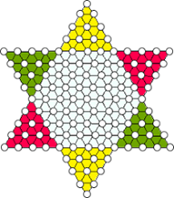

十子跳棋是一种可以由二至六人同时进行的棋盘游戏，棋盘为六角星，棋子分为六种颜色，每位玩家拥有 $10$ 枚棋子并摆满一个角，按照规则轮流走棋，以最早全部抵达并摆满对角为优胜。

$2$ 人对局时，初始将棋子放在相对的角上；$3$ 人对局时，将棋子互相间隔一个角摆放以平均分布；$6$ 人对局时，每个玩家各占一个角。在本次大作业中，不考虑 $4$ 人对局和 $5$ 人对局。

上图为十子跳棋的棋盘。玩家的 $10$ 枚棋子的初始位置为所分配的角上的外四行，靠近棋盘中央的第五行不放任何棋子。
