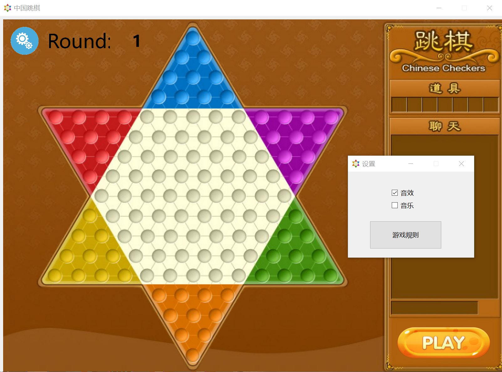
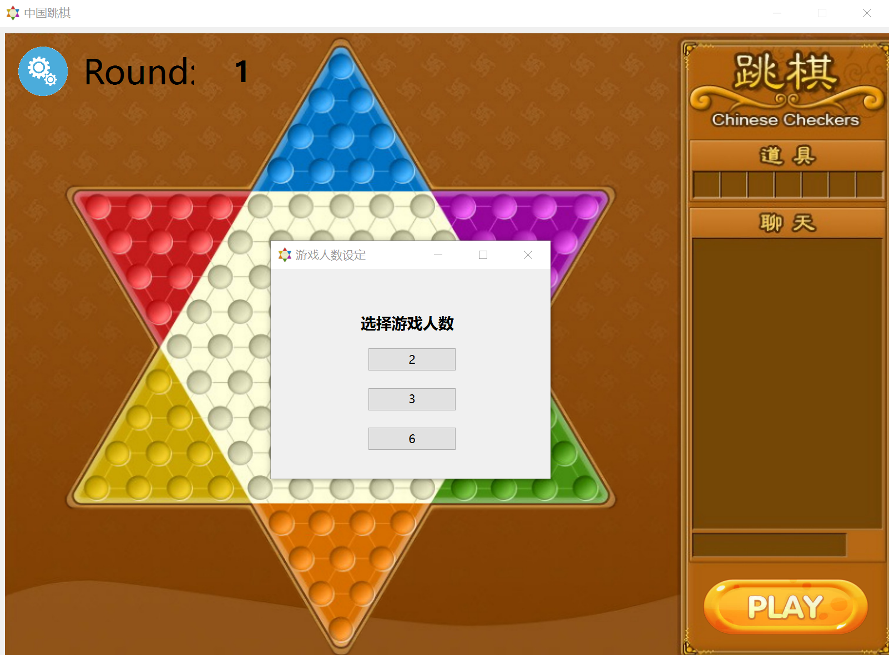
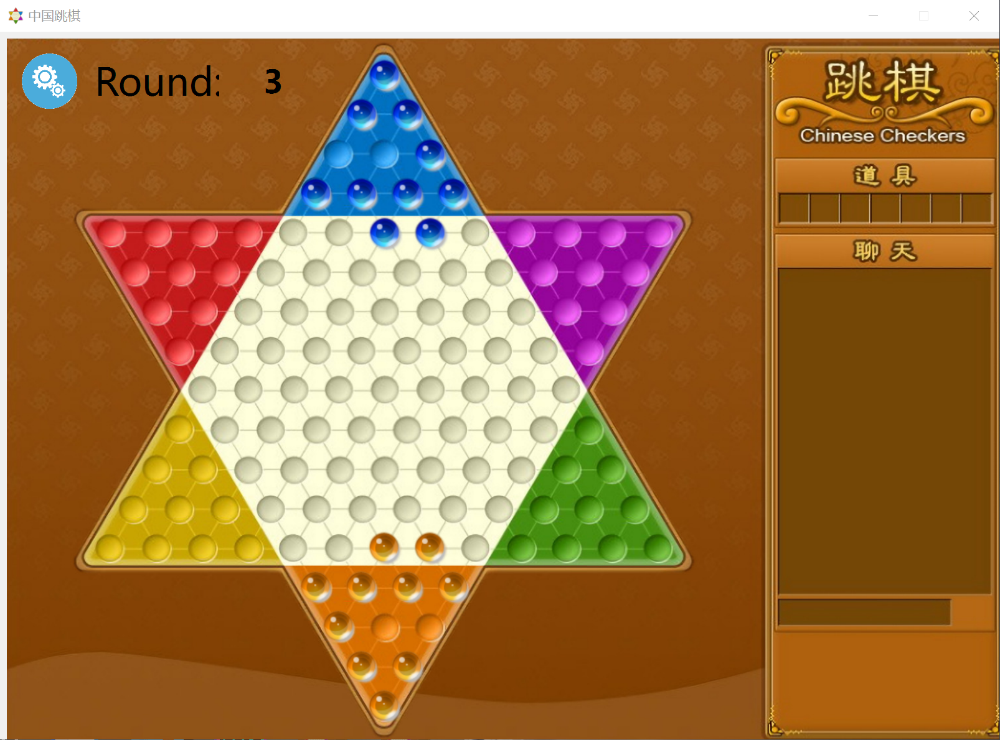

# 第一阶段-跳棋底层逻辑实现
---
## 1.已实现功能

- 基础的图形界面(棋盘,棋子,可行路径点)
- 游戏的启动界面(设置游戏人数,开始新游戏)
- 背景音乐
- 行棋逻辑(棋子移动，控制权移交)
- 困毙与终局判断(待测试)

## 2.待实现功能
- 高亮与解除高亮(接口:```void marble::highlight(),void unset_highlight()```)
- 结束界面(显示玩家排名,再来一局或关闭游戏,这个暂时没有接口,设计好后可以加在函数```void Board::pass_to_nextplayer(int currentidx)```里)
- 其它可视化设计
- 网络联机
- AI

## 3.可以优化的功能

- 可移动位置的BFS(通用化，便于写AI)
- 可移动位置的显示(也许可以改下颜色或图片,具体在函数```void Player::show_hint_btn(Marble *m)```里可以调用)
- 跳棋移动的动画与音效(接口:```void marble::jumpto(std::vector<QPoint> _path)```)
- ......

## 4.实现过程

### 4.1 **像素坐标**```pixelpositon```,**通用坐标**(棋盘的逻辑坐标)```boardposition```和**玩家坐标**```playerposion```的构建与变换

具体来说就是要用到高代线性空间的知识,需要测算过渡矩阵(测+算),写AI和UI的话就不用管原理,直接调用就好

### 4.2 棋盘类```board```,玩家类```player```和棋子类```marble```的粗实现

三者的逻辑是**has-a**的关系(board has players,player has marbles),通常的是有两种实现方法：**包含**和**私有继承**。私有继承太麻烦(其实是不会写),所以我选择了包含关系,即board类里有成员```std::vector<Player*>players```,player类里有成员```std::vector<Marble*>```,这样的话,每局游戏开始时会创建一个新棋盘,棋盘构造时又会创建相应人数的玩家,玩家初始化时又会创建10个棋子,这样基础框架就搭好了

### 4.3 可移动位置的BFS与提示按钮显示

关于点击棋子后的可行路径点的显示,我起初是做的标签(偷懒用的已实现的marble类),但做完后发现虽然显示可行路径点没有问题,但这个方式不利于困毙的判断和后续AI算法的实现，所以我改成了提示按钮，同时把可移动位置的BFS放在了玩家是否困毙的判断里，自己存在了棋子的```std::vector<QPoint>hint_points```里,当玩家点击对应的棋子后,player类读取棋子的```hint_points```并生成提示按钮,若点击提示按钮，player类将回溯路径,实现棋子跳跃,若点击其它棋子,则player类将删除当前的提示按钮,读取新点击的棋子的```hint_points```并生成新的提示按钮。

### 4.4 棋子移动与控制权移交

棋子移动目前是简单地从原位置消失然后在目标点出现,希望之后能通过qt的库函数呈现完整的跳跃过程.控制权移交的代码部分比较复杂,具体展开的话,当一个玩家行棋结束后,首先判断是否满足胜利条件,若满足则设置相应的状态,之后调用```pass_to_nextplayer```函数,检查是否所有玩家都结束了游戏,若是则结束本局游戏,否则计算下一名玩家的idx,激活该玩家,激活时首先判断玩家是否困毙,**在判断时会顺便搜索并记忆玩家所有棋子的可行路径点**,若困毙则清除棋子,移交控制权,否则才能设置为激活状态
调用关系:```on_btnclicked```->```pass_to_nextplayer```->```set_activatedplayer```->```isstuck```-  -  ->```pass_to_nextplayer```(最后一步只有在困毙时被调用)

### 4.5 关于UI和其他设置
UI界面如果有图片的话，选择图片进行操作是一个较好选择（虽然修图片过程挺痛苦的），因为方便后续坐标的调整，同时也避免了过多的ui界面标签与按钮。对于其他界面（如设置音乐开关，选择游戏人数等），新建一个ui界面比调用各种对话框效果更好。同时在同一个项目不同窗口通信时，connect和slot的使用最安全也最稳定，用static来避免类实例化经常出现各种问题不让编译，，，

## 5.踩过的坑

由于没有系统学习gt,所以我在探索```setgeometry```显示元件的用法上花了很长时间,这里总结一下几个关键点：

1. 调用元件的```setGeometry```设置的是在**父控件**的位置,所以元件初始化时要记得继承父控件
2. 有的时候元件的Visible属性为False，所以为了保证能够显示出来，需要调```setVisible```函数
3. qt的坐标系统(窗口与视口)其实不用管,一般用不到那么复杂(反正我没用到)
4. 信号传递用connect信号和槽最方便，静态函数和全局变量设置不好很容易让人崩溃，，，
## 6.界面截图



