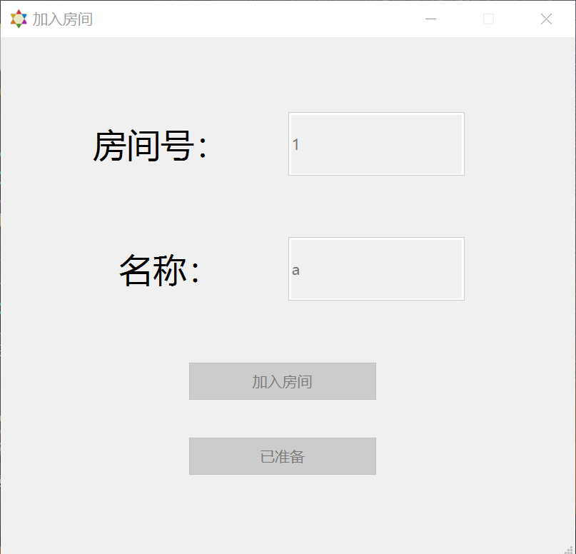
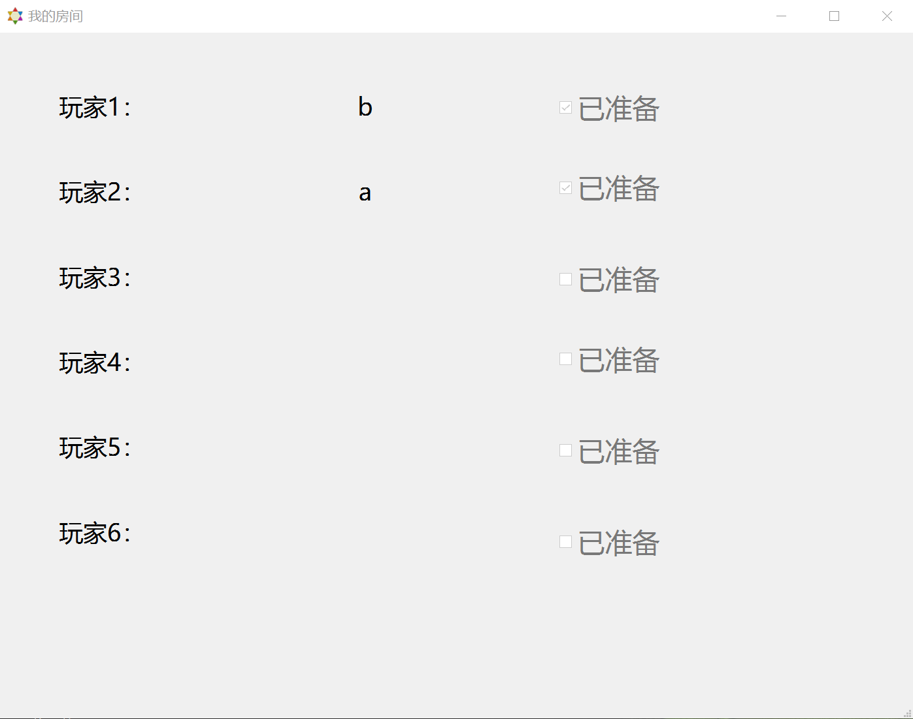
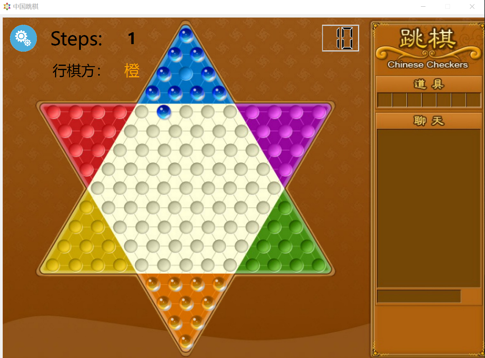
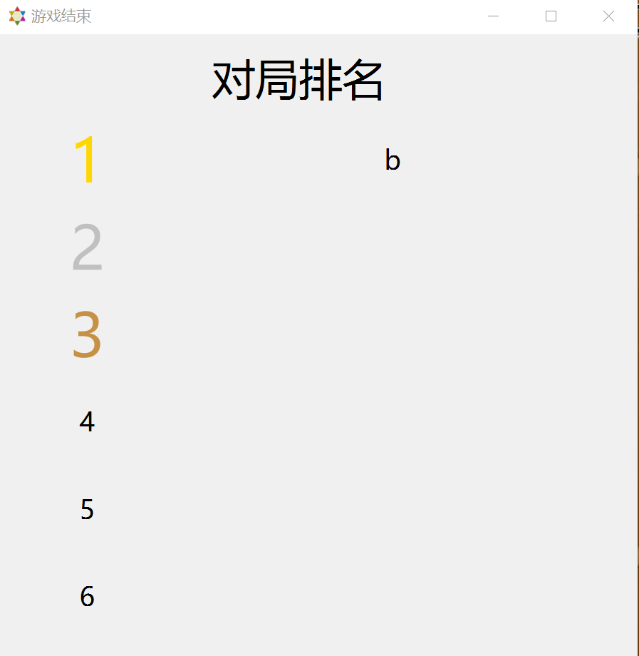

# 第二阶段-跳棋基础网络通信功能实现

## 1.第一阶段基础上已实现功能

- 与客户端进行网络通信，联机游戏的要求功能
- 对客户端的请求进行分析与判断
- 游戏结束后会在客户端显示排名
- 客户端显示当前已走步数，当前行棋方，剩余行棋时间

## 2.待实现功能与可以尝试实现的功能

- AI托管接入
- 行棋动画、音效等其他ui设计

## 4.实现过程

### 4.1服务器的整体构建

运用已经提供的NetworkServer代码新建一个myserver，即成为自己的服务器，服务器需要在打开时开启监听（这里我选择监听任意IPv4，端口9888），接着在receiveData函数中判断从客户端接收到的数据类型，从而进行相应的操作。

### 4.2客户端的完善

客户端首先要自己运用已经给的NetworkSocket创建一个socket套接字，再在局域网中用自己的ip和端口9888（与服务器端口一致即可）连接服务器建立通信。客户端除了行棋的ui界面以外还有加入房间的界面以及看到房间中实时人员状态的界面。对于服务端的消息，客户端在receiveinfo中判断后进行相应的操作，最后通过socket的send函数发送给服务端，从而实现了服务器与客户端的交互。

### 4.3服务端运行说明

#### 4.3.1游戏房间
本次任务中我只打开了一个房间（myroom），多个房间同理，每个房间总共有6个位置，每个位置会记录玩家编号、玩家名称以及玩家准备状态。

#### 4.3.2自定义关键变量
    QTcpSocket* local;
    QList<QTcpSocket*> inroom;
    QList<QTcpSocket*> winner;
    QList<QTcpSocket*> loser;
其中每次接受某一个客户端消息时，便把当前socket记为local，由于连接的客户端并非所有都进入了房间，故对于进入房间的客户端创建一个inroom链表来储存，而winner和loser链表则储存着当前游戏中玩家的胜负者，便于在传递信号与判断对局状态时发挥作用。

#### 4.3.3与客户端通信
每次接收到客户端消息时，会先对消息的合法性进行检查，通过后才可以执行相应的操作，否则返回错误码。由于客户端与服务端相对独立，故两者传递消息不能使用信号与槽而只能通过网络传递消息。注意在给客户端发消息时是给当前客户发、其他客户发还是给全部客户发。

#### 4.3.4服务端自身操作
当操作涉及到房间的人员时，多会直接调用myroom中的函数执行操作，由于myroom是在server中定义的，故这些函数操作后通过信号与槽的方式将结果传递回server本身，这类操作主要包括进入房间、离开房间、玩家准备等；而一些不涉及房间的操作如移动棋子、开始游戏、开始/结束回合、结束游戏等则主要靠server自身的函数进行判断。

### 4.4客户端运行说明

#### 4.4.1子界面
客户端拥有2个子界面，分别是加入房间界面（room_opt）、我的房间（c_room）和排名（rank），点击开始游戏（play）按钮后，会先出现加入房间界面，用户正确输入用户名和房间并成功进入房间后才会显示我的房间界面，游戏结束后显示排名界面。

#### 4.4.2与子界面传递消息
主要是通过函数调用已经信号与槽（与服务端一样），用户在子界面输入信息后通过信号与槽传回主客户端界面，主客户端界面执行操作则调用子界面函数

#### 4.4.3客户端自身操作
在接受到服务端消息后，客户端会根据消息类型进行相应操作，与房间人员状态有关的操作（进入房间、离开房间、玩家准备等）调用c_room的函数进行处理，与棋盘的操作则运用第一阶段的核心代码完成棋子的设置、移动和清除。客户端具体的代码操作在头文件和源文件里里作了较详细的说明，这里不再赘述。

### 4.5一些细节与经验分享

####4.5.1代码风格与qt调试
1.尽可能地将自己定义的函数与变量放在类头文件里面，而不要放在源文件里面，更不要随意设置成全局变量或是静态变量，#include语句最好整合到头文件中。

2.在代码里更新ui后，需要重新编译后在相应的release/debug文件夹中将对应的uixxx.h文件拷贝覆盖自己原来的ui文件，否则可能出现在自己的源文件里面无法调用更新ui的相关组件的问题。

3.为了方便多开调试，由于qt生成的exe是动态连接的，故需要通过命令行（windeployqt)将相关的dll文件拷贝至exe的目录，从而实现应用程序的多开。

4.边写代码边加注释，方便自己后续进行调试工作。

####4.5.2做服务器的一些经验
1.测试是否连接好（比如我最初是检测client列表是否非空），不要在一打开服务器时就检测，而是最好设计一个按钮，点击以后再检测，否则可能出现执行检测代码时还未连接的情况而造成误判。

2.关于OPCODE和ERRCODE的使用，前者使用OPCODE::xxxxxx的方式调用，而后者使用QString::Number((int)ERRCODE::xxxxxx)的方式转换成字符串调用。

3.要善于运用信号与槽，子窗口与父窗口之间的信号传递中信号与槽是最稳定的方法之一，但要记得在头文件中添加signals和对应的slots，注意不要把signals拼成了singals，，，

4.接收客户端消息前一定要进行检查，检查的方式应该是规定正确的消息格式，从而使其他格式都是错误的，保证服务器的相对稳定。

5.链表（QList）运用在服务器中记录进房人数、房间人员信息等方面比数组更加便捷，因为在人员增减频繁时，使用链表管理免去了数组需要手动移位造成的各种问题。比如我代码里面的inroom，winner，loser链表。

####4.5.3做客户端的一些经验
1.客户端与服务器连接时需使用自己的ip（或者本地ip127.0.0.1）和与服务器一样的端口才能成功连接，不能使用代理网络和VPN！！

2.要注意按钮的可选性和窗口出现的先后性，比如需要先进入房间才能再准备，要先成功进入房间才能显示房间内界面。

3.关于当前行棋方的颜色变化，可以通过改标签的样式表来解决，palette方法用了以后总是失效，可能是我没配置好。

4.运行时出现各种bug都不要太奇怪，调试就是个考验耐心的活，，，，，，

## 5.运行截图

