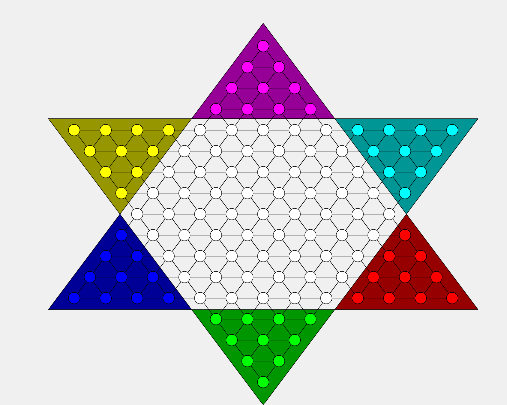
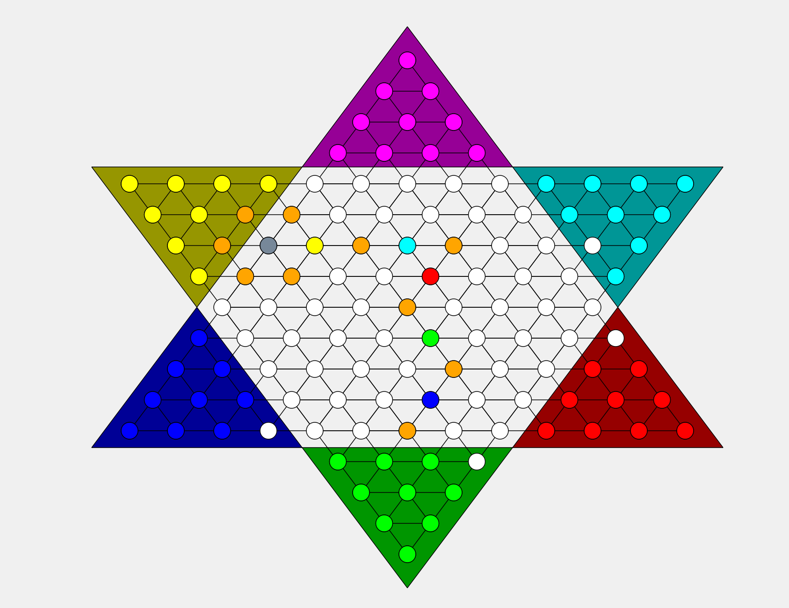

# 第一部分报告

# 一、初始界面的设计
- 包含2,3,6人的游戏模式和退出按钮

# 二、棋盘的设计
1. 绘制棋盘：Qpainter画出6个三角形，分别代表六个棋群的位置，方便之后的染色、标记等操作。绘制121个棋盘位置，半径为12的圆形，绘制三个方向的斜线，最后将棋盘位置染成白色。将六个棋群所在三角形以及六个棋群染色（QPainter，Qbrush，drawLine，drawEllipse）

2. 坐标计算：i =（33,0），j =（0,44），横向棋子之间距离为66，斜线方向两个棋子之间为55。

3. 初始化操作：将棋盘上有棋子的地方用occupied数组标记为真，其余为假，并在之后每一次移动中更新这个数组的状态。

# 三、棋子的基本移动
1. 创建棋盘坐标类Location，包含横纵坐标x1，y1和棋子类Stone，包含横纵坐标x0，y0；

2. 将121个棋盘和60个棋子的横纵坐标与棋盘的像素坐标一一对应，并编号；

3. 设置两个参数：_selected_id，click，用来记录已选中的和当前点击的位置，将两个值初始化为-1；

4. 调用mouseEvent函数，获取鼠标所点的像素坐标，定义函数canMove来检测点击位置是否有效，具体实现分两种情况：
- 此次点击之前无有效点击
    1. 取出点击位置的横纵坐标；
     
    2. 遍历棋盘的121个位置，计算这个坐标位和每个圆心的距离，如果小于半径，则为有效点击，取出当前棋盘位置的编号；
     
    3. 遍历棋子的60个位置，检测是否有一个棋子的位置和刚才点击的位置重合，如果有，将click赋值为棋子编号；
     
    4. 此时_selected_id的值为-1，将_selecetd_id=click，则记录了选中的棋子，调用update( )将棋子重新染色；
- 此次点击之前有有效点击
    1. 若此次点击也为有效点击，取出坐标，将选中棋子（s[_selected_id]）的横纵坐标更新为目前的棋盘坐标，并调用update()函数；

# 四、移动合法的判断
1. 设计基本规则：若相邻六个点周围无棋子，可以跳周围相邻的；若相邻六个点有棋子，且间隔相邻棋子的对应点无棋子，则可以跳。

2. 创建函数canMove，判断移动操作是否合法。在周围无棋子的情况下，如果移动距离小或等于两相邻点间的最大距离，则为合法操作；在有棋子作为跳板的情况下，若移动距离小或等于两倍的两相邻点的最大距离，则为合法操作。这个过程中由occupied数组判断周围是否有棋子以及棋子是否可以作为跳板。

# 五、可移动位置的提示
### 5.1判断连跳（深度优先搜索）：
1. 第一层：搜索周围六个点，若无棋子，则将其标记为可能位置，用数组Possible_Location标记，并同时调用update( )染色；若有棋子，且其隔空位无棋子，将其隔空位标记为Possible_Location，并染色，然后将其作为中心点进行下一次深搜；

2. 第n层（n>=2）：若无棋子，则停止搜索；若有棋子且满足跳板条件，同第一步；

### 5.2还原：
1. 每次深搜完成之后，要将染色的可能位置变为原色，即白色，所以需要设计一个函数wipe_dbfs()，将Possible_Location标记的位置全部染回白色

2. 由于棋子所走的位置一定也是在Possible_Location上，也会被染成白色，所以还需要定义current_x和current_y记录刚才移动棋子的位置，避免被染成白色。

# 六、回合的轮转
1. 设置轮转：在类中定义pattern变量，记录对战模式。重写QMainWindow的构造函数，应用控件，将对战人数的信息传到pattern中。pattern决定棋盘的初始染色和轮转模式。

2. （以六人模式为例）此时pattern为6，state为目前轮转的状态，0-5分别对应六个棋群，state%pattern值决定当前哪个棋群可以选中。

# 七、效果展示
1. 界面

2. 自动判断（橙色为可能跳到的位置，灰色为当前选择的棋子）

      
      
      
      
      
      
     
        
     
     
      