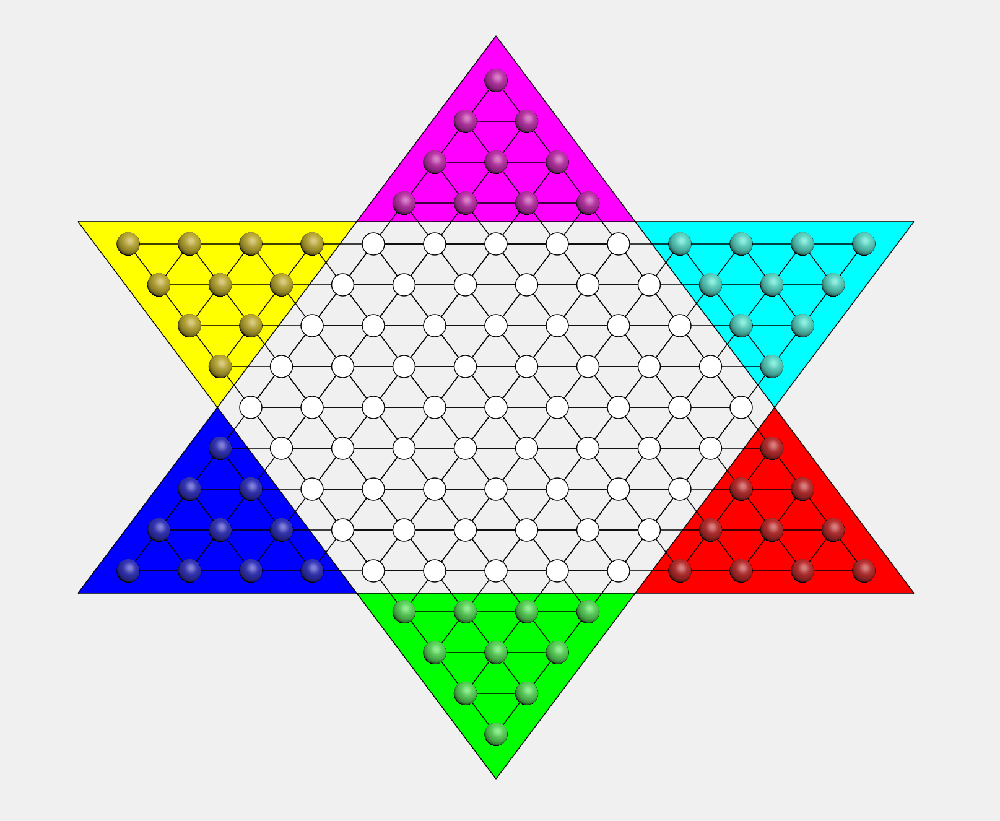
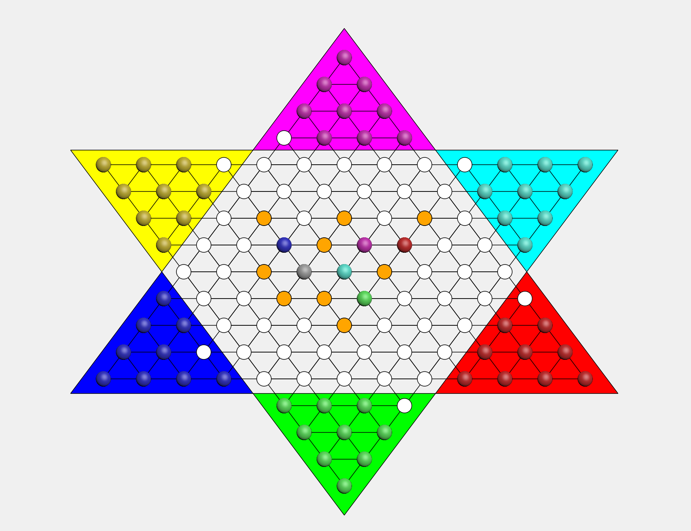

# 第一阶段报告

## 界面设计

设计开始界面：包含$2$,$3$,$6$人游戏模式和退出按钮。

## 棋盘设计
### 绘制棋盘

1. `Qpainter`画出$6$个三角形，分别代表六个棋群的位置，方便之后的染色、标记等操作。
2. 绘制$121$个棋盘位置，半径为$12$的圆形，绘制三个方向的斜线，最后将棋盘位置染成白色。
3. 将六个棋群所在三角形以及六个棋群染色(`QPainter`,`Qbrush`,`drawLine`,`drawEllipse`)。

### 坐标计算

- $i=(33,0)$，$j=(0,44)$，横向棋子之间距离为$66$，斜线方向两个棋子之间为$55$。

### 初始化操作

- 将棋盘上有棋子的地方用`occupied`数组标记为真，其余为假，并在之后每一次移动中更新这个数组的状态。

## 棋子的基本移动

### 准备工作 

1. 创建棋盘坐标类`Location`，包含横纵坐$x1$，$y1$和棋子类`Stone`，包含横纵坐标$x0$，$y0$。
2. 将$121$个棋盘和$60$个棋子的横纵坐标与棋盘的像素坐标一一对应，并编号。
3. 设置两个参数：`_selected_id`,`clickid`,用来记录已选中的和当前点击的位置，将两个值初始化为$-1$。

### 调用`mouseEventRelease()`函数

获取鼠标所点的像素坐标，定义函数`canMove()`来检测点击位置是否有效，具体实现分两种情况：

+ 此次点击之前无有效点击
    1. 取出点击位置的横纵坐标。
    2. 遍历棋盘的$121$个位置，计算这个坐标位和每个圆心的距离，如果小于半径，则为有效点击，取出当前棋盘位置的编号。
    3. 遍历棋子的$60$个位置，检测是否有一个棋子的位置和刚才点击的位置重合，如果有，将`clickid`赋值为棋子编号。
    4. 此时`_selected_id`的值为$-1$，将`_selecetd_id`=`clickid`，则记录了选中的棋子，调用`update()`将棋子重新染色。
+ 此次点击之前有有效点击
    - 若此次点击也为有效点击，取出坐标，将选中棋子(`s[_selected_id]`)的横纵坐标更新为目前的棋盘坐标，并调用`update()`函数。

## 规则设计
### 基本规则

1. 若相邻六个点周围无棋子，可以跳周围相邻的。
2. 若相邻六个点有棋子，且间隔相邻棋子的对应点无棋子，则可以跳。

### 具体实现

创建函数`canMove()`，判断移动操作是否合法。

1. 在周围无棋子的情况下，如果移动距离小或等于两相邻点间的最大距离，则为合法操作。
2. 在有棋子作为跳板的情况下，若移动距离小或等于两倍的两相邻点的最大距离，则为合法操作。
3. 这个过程中由`occupied`数组判断周围是否有棋子以及棋子是否可以作为跳板。

## 连跳设计
### 判断连跳（深度优先搜索）

1. 第一层：搜索周围六个点，若无棋子，则将其标记为可能位置，用数组`Possible_Location`标记，并同时调用`update()`染色；若有棋子，且其隔空位无棋子，将其隔空位标记为`Possible_Location`，并染色，然后将其作为中心点进行下一次深搜。
2. 第$n$层$(n≥2)$：若无棋子，则停止搜索；若有棋子且满足跳板条件，同第一步。

### 还原

1. 每次深搜完成之后，要将染色的可能位置变为原色，及白色，所以需要设计一个函数`wipe_dbfs()`，将`Possible_Location`标记的位置全部染回白色。
2. 由于棋子所走的位置一定也是在`Possible_Location`上，也会被染成白色，所以还需要定义`current_x`和`current_y`记录刚才移动棋子的位置，避免被染成白色。

## 回合轮转

1. 设置轮转：在类中定义`pattern`变量，记录对战模式。重写`QMainWindow`的构造函数，应用控件，将对战人数的信息传到`pattern`中。`pattern`决定棋盘的初始染色和轮转模式。
2. （以六人模式为例）此时 `pattern` 为 $6$，`state` 为目前轮转的状态，$0 \sim 5$ 分别对应六个棋群，$\texttt{state} \bmod \texttt{pattern}$ 值决定当前哪个棋群可以选中。

## 效果展示

1. 界面

2. 自动判断（橙色为可能跳到的位置，灰色为当前选择的棋子）

