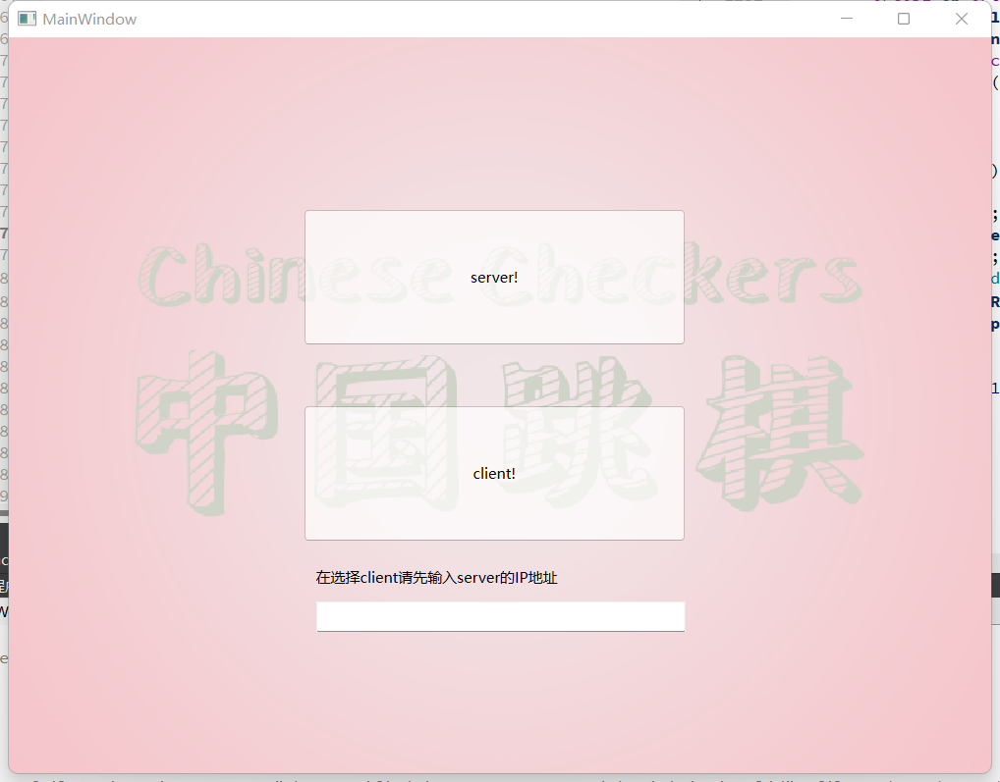
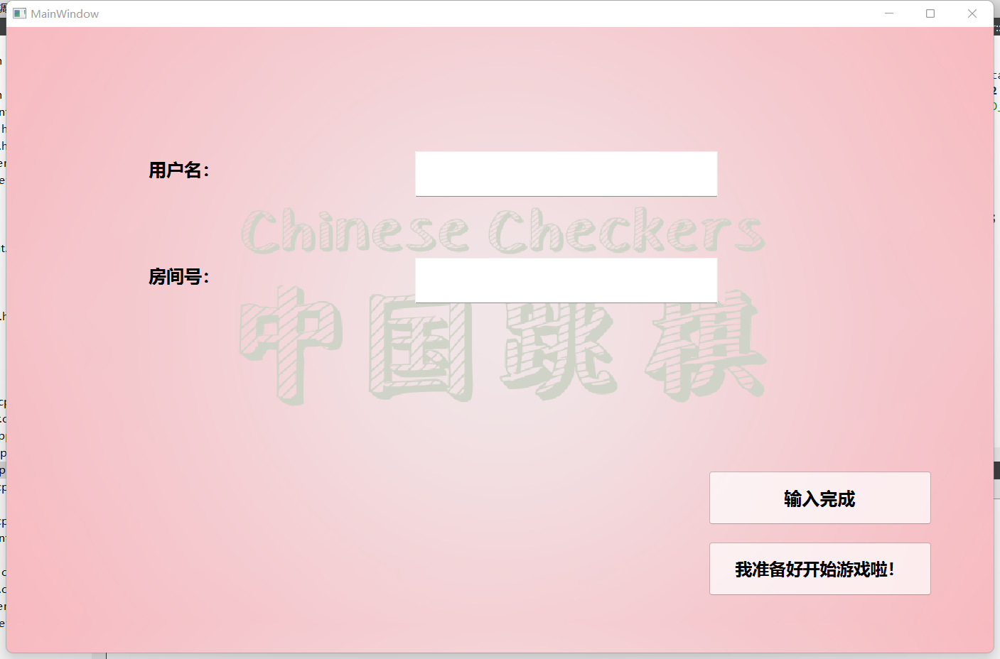
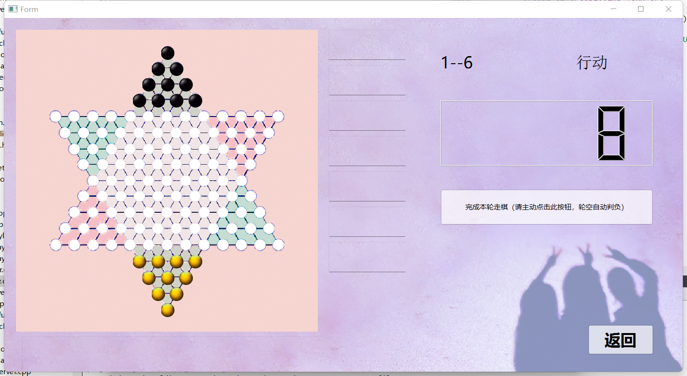

# 第二阶段 跳棋基础网络通信功能实现

## 本阶段实现的功能

-构建客户端、服务端，实现了合理、流畅的网络交互

-客户端作为参与玩家与服务端建立连接并发送请求

-服务端能将客户端的请求汇总并回复

-客户端正常走棋（单步与连跳），并在其他玩家的界面上显示

-判断终局、轮空判负、显示排名

-错误信息处理

## 游戏流程

### 开始界面

开始界面上分为多个按钮，分别对应：联机模式、单机模式的二人、三人、六人游戏、游戏规则和结束游戏。联机游戏按钮为第二阶段新加，这个按钮通过信号和槽连接界面`serverorclient` ,即选择客户端和服务端的界面。

### 选择客户端或服务端

在此界面上，有两个按钮：server 和client。若选择以服务端模式运行，则会进入服务端界面。此按钮通过信号和槽，实现了此界面和服务端界面的连接。若选择以客户端模式运行，需要先输入想要连接的服务器的ip地址，端口号已经在程序中固定为18888。然后点击client按钮，通过hello函数向服务端发送连接请求，连接了服务端。并且在此设立`connect`，使已经存在的`gameplay*`型指针在不同窗口间传递信息。

```c++
connect(this,SIGNAL(sendData(gameplay*)),jrc,SLOT(getData(gameplay*)));
connect(jrc,SIGNAL(sendData(gameplay*)),this,SLOT(getData(gameplay*)));
```

若连接成功，则发送connected函数，并弹出弹窗告诉玩家已连接成功。若未连接成功，也弹出弹窗告诉玩家连接失败。玩家需自行重新连接。

```c++
void serverOrClient::errorOccurred()
{
    isError *err=new isError();
     qDebug()<<"There is error!!";
    err->show();
}
void serverOrClient::connected()
{
    isSuccessful *suc=new isSuccessful();
    qDebug()<<"There is successful!";
    suc->show();
}
```

### 输入名称和房间号

此界面包含两个输入框和两个按钮。输入框内应输入用户自定义的名称和房间号。

然后按下按钮1：“输入完成”。此按钮调用`joinRoom`函数，在此函数中，客户端向服务端发送`JOIN_ROOM_OP`请求，并发送自己的名称和房间号。服务端收到消息后先将客户的名称存在自定义的`QList`中，然后进行简单判断，看是否游戏已经开始、房间名是否为空、房间名格式是否错误、用户名是否为空、用户名是否被用过等并返回错误信息。若无错误，则向原玩家返回`JOIN_ROOM_REPLY_OP`，并给其他玩家发送`JOIN_ROOM_OP`，告知其他玩家新玩家已加入。

最后按下按下按钮2：“我已经准备好啦！！”。客户端向服务端发送`PLAYER_READY_OP`，并创建显示` waitingRoom`窗口。服务端收到请求后，向当前房间内的所有玩家转发这一请求，并将相应的`thePlayer`数组中`isReady`设为1，再通过`isReady`进行判断，若超过两个玩家进入房间并已经准备好，就开始游戏，发送`START_GAME_OP`给所有玩家。并将数据段 `data1` 和 `data2` 分别设置为玩家列表和每个玩家被分到的初始区域。

### 等待房间

玩家按下“我已经准备好啦！！”按钮后会进入此界面，并且等待其他玩家准备就绪并进入等待房间。服务端掌握所有玩家的人数和准备状态，若超过两个玩家进入房间并已经准备好，就开始游戏，发送`START_GAME_OP`给所有玩家。客户端自动进入游戏界面。

### 开始游戏

当系统判断有两人或以上进入房间，且全部准备就绪时，就向所有玩家发送`START_GAME_OP`指令。进入棋盘界面，等待三秒后向第一位玩家发送`START_TURN_OP`指令

### 行棋

在行棋流程中，由服务端判断`MOVE_OP`中的移动路径信息是否合法，客户端只负责记录行其路径并将其打包成networkdata发给服务端。

客服端的行棋规则合法性判断与前面单机游戏中是一样的。在行棋后，客户端并不会立即显示已经完成的棋子，只有在服务端判断其行其合法，并向包括行棋者在内的所有玩家都发送`MOVE_OP`指令后才能显示棋子的最终移动。


### 控制权转换

在多人游戏中，可能有玩家中途退出或因轮空而被判负。所以控制权转换不能直接从一个人转到下一个人，而是每次转移前都应该进行判断：下一个人是否还在正在游戏中。

我们在玩家中设置`isReady`来表达此玩家是否在游戏状态，如果玩家轮空判负或中途退出，即将`isReady`设置为0作为控制权转移的判断条件。

### 计时处理

设置`myTimer`时间槽函数用于计时，`myTimer->start(1000)`，即每一秒调用一次时间槽函数。每次调用该函数时将用于计时的`countTime`减一。每次移动判断玩家移动符合规则时，即将`countTime`初始化。

### 轮空或中途退出

我们设置了`vectorPieces`容器来存放最多60个旗子。当有玩家因超时而被中途判负或自己选择退出时，在容器中将该玩家对应的棋子erase掉。这样可以避免中途退出的玩家的棋子在棋盘上影响其他玩家移动的情况。

为了避免有人退出后程序对错误的棋子进行操作，我们在所有需要需要遍历vector来获取某一方玩家棋子的时候，都用了`int getNumBefore(int i)`,`int getNumAfter(int i)`,`int getTotalNum()`几个函数来得到正确的玩家数目。

### 终局判断

通过计数一个玩家的十个棋子是否都到达了对面三角形区域来判断他是否已经取得胜利。每次有玩家完成了一次正确移动都要调用`judgeWin`函数判断一次该玩家是否已经获得胜利。将获得胜利的玩家依次存在一个数组里。当在场所有玩家都已经获得胜利时，服务端发送`END_GAME_OP`指令使客户端显示排名界面。

为了避免已经获得胜利的玩家因超时而被判负，将他的`isReady`变量设为0来避免控制权转到他，从而避免他因超时被判负.

## 调试细节

### 联网部分

一开始我们无法联网，在课程群里参考了同学的建议（在此表示特别感谢！），在NetworkServer构造函数增加如下代码：
~~~
this->listen(QHostAddress::ip,port)
~~~


### 空指针

exe.crashed是我们经常遇到的一个问题，面向CSDN编程，我们了解到这是程序中的“指针乱飞”造成的，通过打断点调试，我们逐渐找出了很多“凌乱”的空指针、野指针。

### 与第一阶段程序的整合

为了更好地联系第二阶段，我们对第一阶段的程序做了一定程度的修改，例如坐标系的建立方法、棋子坐标的改动、不同游戏人数的实现思路，在改动的同时，机械的复制粘贴就导致了很多的bug。

例如
~~~
void gameplay::changeInfo(int m1,int n1,int m2,int n2)
{
    //qDebug()<<"changeinfo:"<<this->cb->chessBoard[m1][n1].piecePlace<<"("<<m1<<","<<n1<<")";
    this->select=this->cb->chessBoard[m1][n1].piecePlace;
    this->cb->chessBoard[m1][n1].flag=0;
    this->cb->chessBoard[m2][n2].piecePlace=this->cb->chessBoard[m1][n1].piecePlace;
    this->cb->chessBoard[m2][n2].piecePlace->setPlace(m2,n2);
    this->cb->chessBoard[m1][n1].piecePlace=NULL;
    this->cb->chessBoard[m2][n2].flag=1;
    //qDebug()<<"changeinfo:"<<this->select<<"("<<m1<<","<<n1<<")";
    this->select->move(cb->chessBoard[m2][n2].x,cb->chessBoard[m2][n2].y);
    lightColor=0;
}
~~~

程序运行到`changeinfo`时，总会报空指针的错误，原因是我们在复制粘贴时，搞错了两行代码的位置，把`this->select`指成了空指针。（这么多行的`qDebug()`见证了我们的属实不易）

### 数学逻辑错误

一开始，我们没有计算好棋子坐标的数学逻辑，就导致界面里棋子乱放；后期由于数学逻辑有误导致的数组越界，程序崩掉……

### 语法逻辑错误

switch的case里不放break；while循环里没有放终止条件。所以我们调试的时候经常遇到意想不到效果……

## 效果展示







