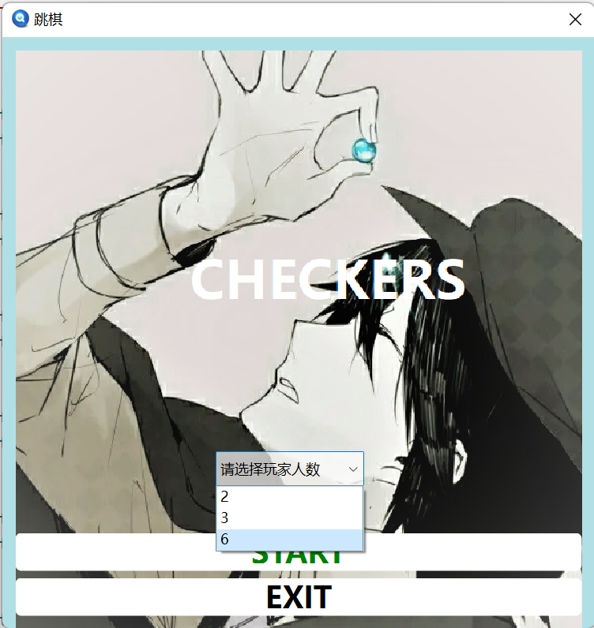
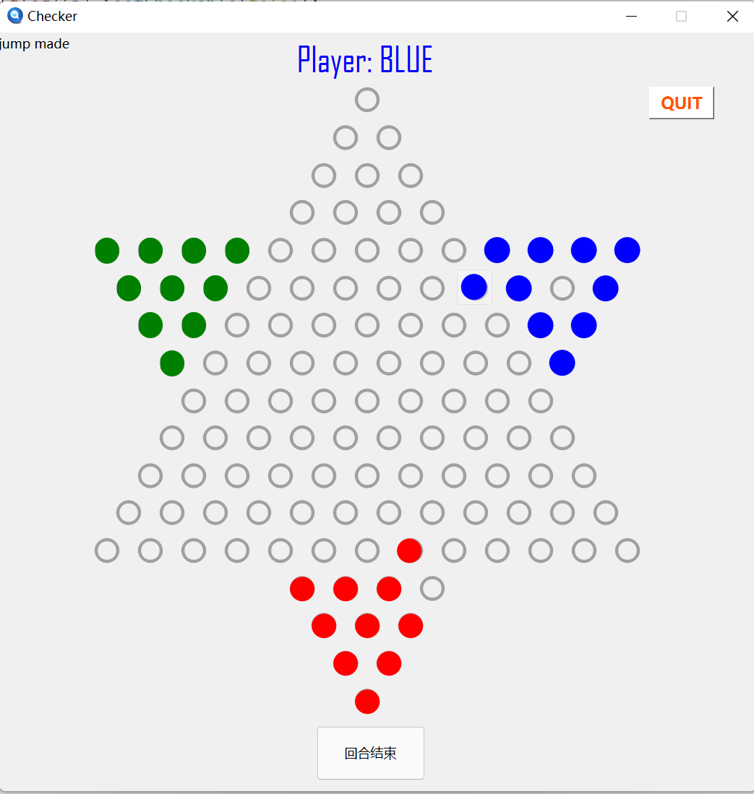

# 第一阶段报告
## 1.小组分工
- 王卓冉：棋盘绘制，坐标计算与落子范围界定
- 苏家齐：构造棋子类，合法性判断，更换棋手
- 骆娜：开始界面，开始及退出游戏功能
## 2.功能分析
- 可实现进入退出游戏
- 可实现进入前选择人数
- 可实现判断玩家行棋合法性
    - 允许平动，跳跃，连跳
    - 不允许移动至界外
    - 不允许回合内不行棋
- 可显示执棋方
- 可实现平动后自动切换执棋方，跳跃后由玩家决定是否结束本回合
- 可确保棋子位于棋盘格内
## 3.代码框架设计
### 3.1 开始界面
由继承自QDialog的myDialog类实现

- 使用两个QPushButton决定进入或退出游戏
- 使用一个public的ComboBox决定玩家人数
### 3.2 游戏界面
由一个widget窗口实现
#### 3.2.1 变量
- 二维数组loc：记录棋子坐标
- bool型二维数组isfill：记录对应位置是否有棋子
- checkerButton类：棋子
    - 由player成员记录该棋子所属执棋方
    - 由int型变量x，y记录棋子对应loc坐标
-  使用QPointF记录目标点及选中棋子的像素坐标
-  使用int记录选中棋子及目标点的loc坐标
-  一个QDialog作为轮空时弹出的警告
#### 3.2.2 函数
- islegal：判断行棋合法性
- pixel2int：将像素坐标转化为loc坐标
- CheckerMove：棋子移动动画
- CanJump：返回是否可以进行下一次跳跃
- ChangePlayer及shouldSwitch：执棋方转换
### 3.3 退出界面
由继承自QDialog的myDialog1实现

- 两个button决定是否退出
## 4.游戏流程
### 4.1开始游戏
- 选择下棋的人数
- 选择开始游戏
- 棋盘界面根据人数进行调整
### 4.2游戏过程
- 鼠标操纵棋子移动进行游戏
- 点击“回合结束”按钮手动结束本回合，或平动后自动结束回合
### 4.3结束游戏
- 点击右上角QUIT按钮退出
## 5.效果展示

## 6.遇到问题及解决办法
*问题主要是通过搜索CSDN解决*

1. Q:编译出现undefined reference to ‘vtable for’

    A:继承类没有添加O_OBJECT宏。添加后还是不行，于是把整个类删了重新写，再编译就ok了。
   
2. Q: 运行程序报.exe crashed

    A:第一次看到这样的错误不知所措，于是用debug模式运行，报SIESEGV，仔细一看发现改代码的时候没new空间就改了对象属性。

3. Q:目标位置合法但无法移动

    A:这里检查后发现，移动棋子后，涉及记录的变量没有全部改，对后续棋子移动合法性判断造成了影响。很小一个问题但是困了很久。得到的教训就是要对着自己写的变量一个个更新。