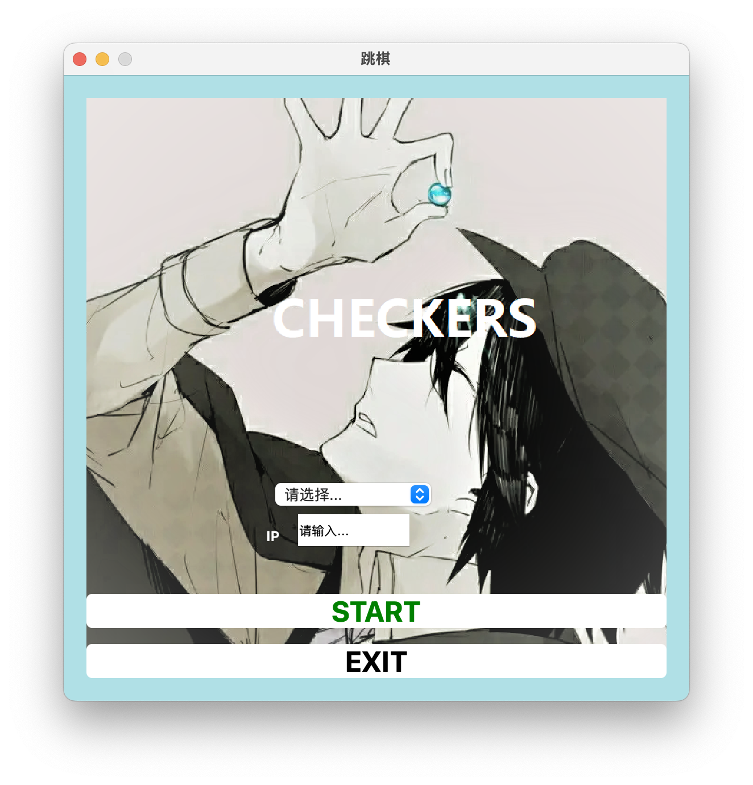
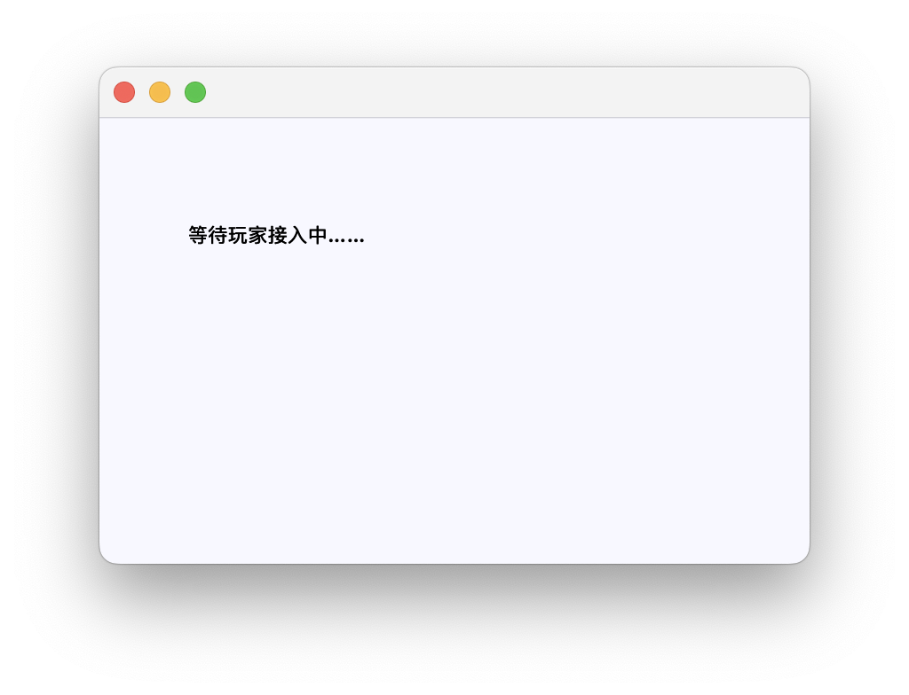
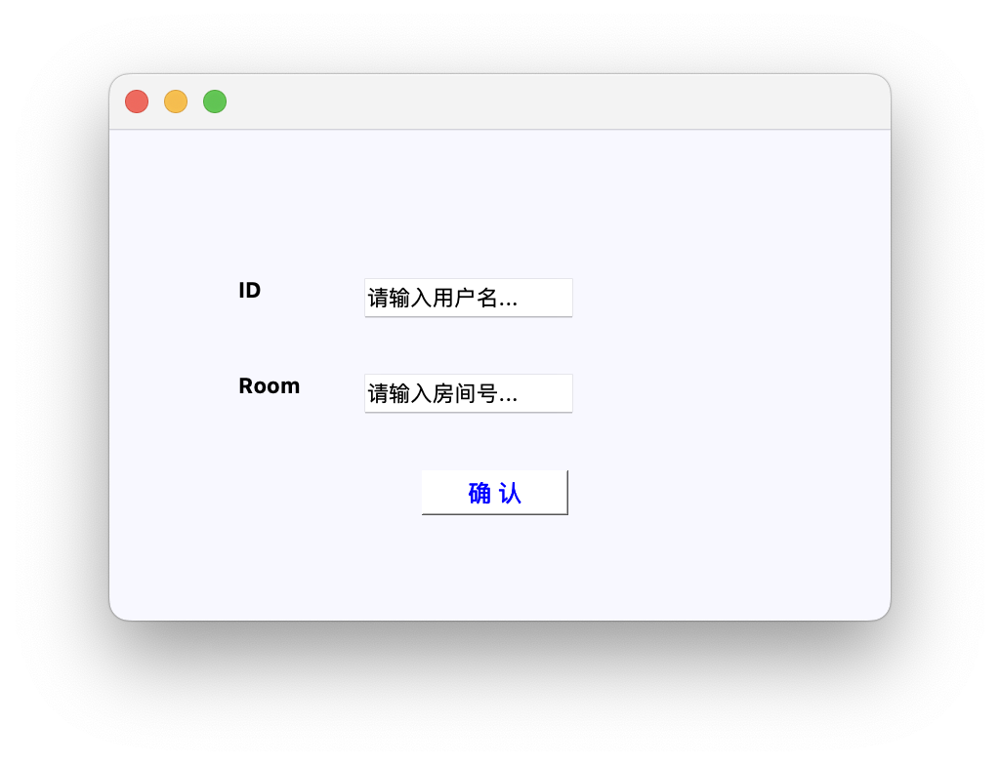
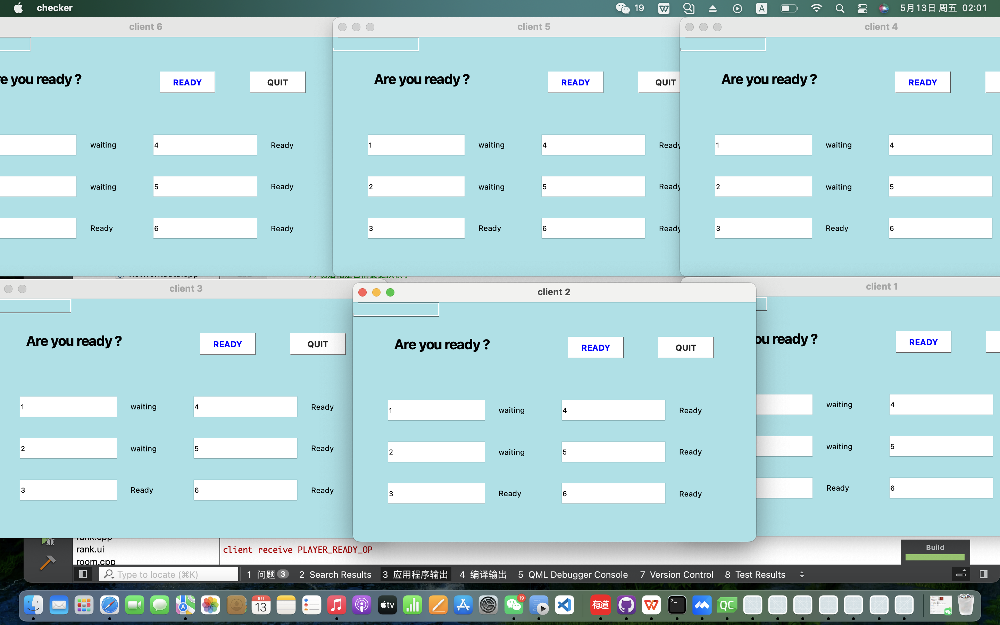
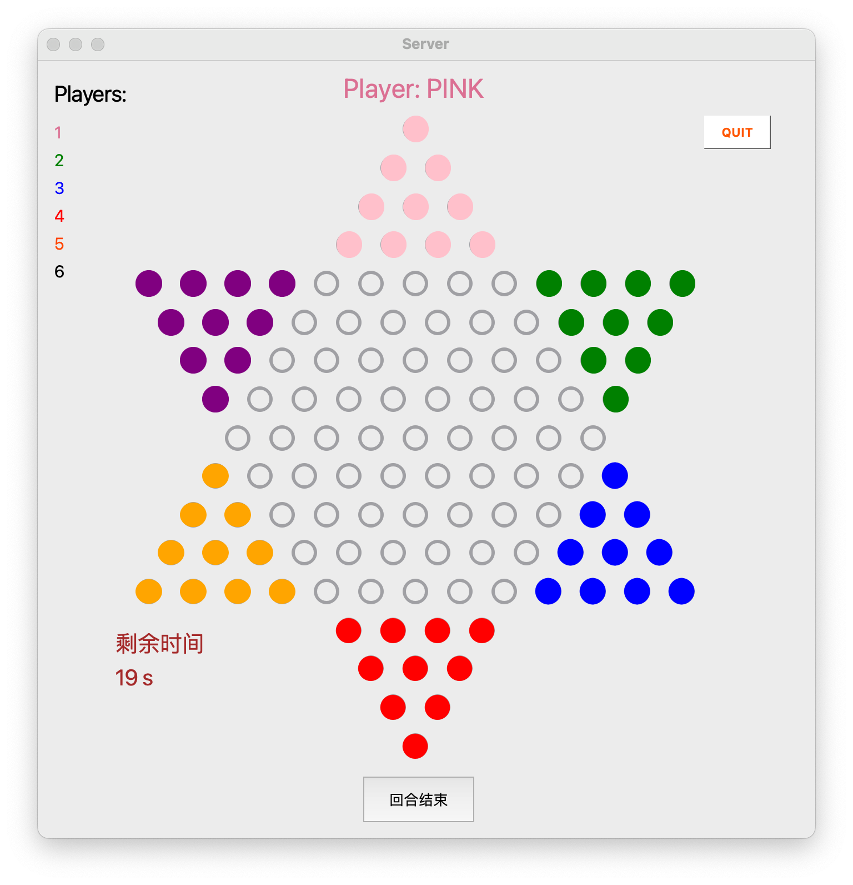
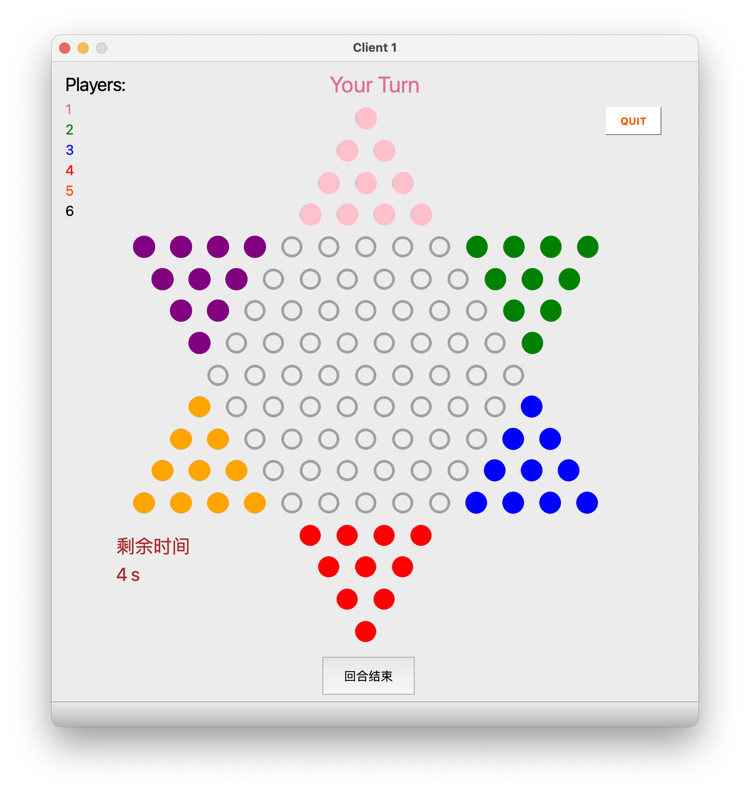
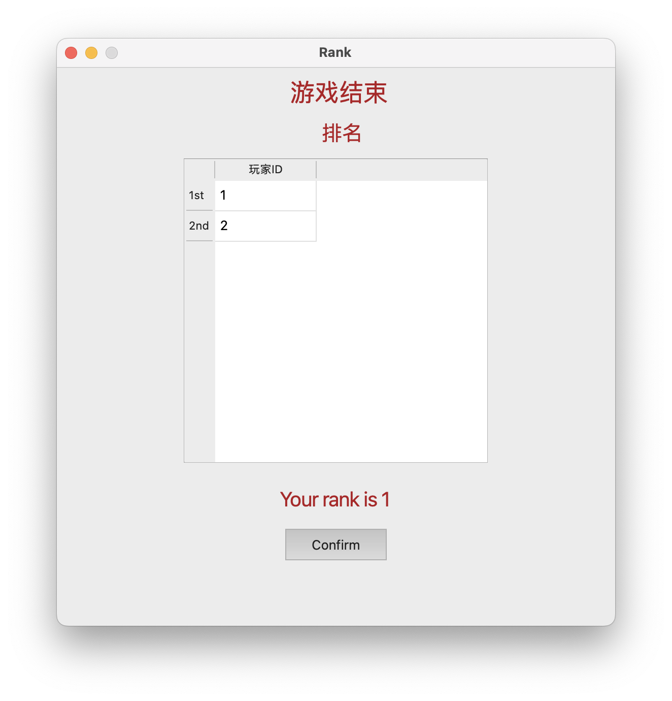

# 第二阶段报告

## 1.小组分工
+ 王卓冉：终局判断，实现服务端棋盘界面随客户端变化等

+ 苏家齐：实现receive和receivedata函数、合法性判断等

+ 骆娜：选择、等待界面及连接，限制输入格式及输入位数等

## 2.代码框架设计

### 2.1开始界面
+ 选择进入客户端或服务端

+ 输入IP地址进行连接，并使用QValidator和QRegExp等限制只能输入数字和小数点，也限制输入的位数

### 2.2输入界面
+ 客户端输入并传送用户名和房间号至服务端

+ 使用QValidator和QRegExp等限制输入的只能是英文字母大小写、数字及下划线

+ 服务端等待客户端接入，服务端使用room类存储用户名及是否准备开始游戏的信息

+ 使用QStringList和QList等存储用户名和用户状态

### 2.3等待界面
+ 用户进入时用players和playerState分别初始化用户名和用户状态

+ 客户端可选择准备开始并改变状态，把消息传到服务端并改变room.h中对应的信息

+ 如果客户端选择退出，则其信息会被删除，界面恢复初始状态，包括等待界面和服务端记录的用户数据

+ 服务端的等待界面与客户端相同，可显示各玩家的用户名及状态

+ 利用QLabel实现显示所在房间号

### 2.4棋盘界面
+ 使用QLabel和timerEvent函数实现倒计时，控制下一步的时间在30秒内

+ 如果超时就移走该玩家所有棋子并判负，让一个QList类outlist记录超时判负的成员名单，用另一个QList类ranklist记录胜利的成员用户名

+ 显示成员名单，用户名text分别使用各自棋子的颜色以作为提示

+ 利用QLabel显示所在房间号

+ 上方用QLabel提示该哪一位用户下棋

### 2.5排名界面
+ 利用正序输出ranklist中的用户名并排名，再接着倒序输出outlist中的用户名并排名
+ 结束一轮游戏时可跳转到选择界面，用户自行决定是否再次进行一轮游戏

## 3.遇到的问题及解决方法
+ Q1：程序有时会因为越界而crash
+ A1：使用qDebug或者打断点进行调试

+ Q2：服务端的棋盘界面在随客户端棋盘界面变化时，如果遇到连跳的情况，服务端的棋子会略过连跳的过程，一步到位出现在目标位置
+ A2：在CSDN上查询相关的解决方法并查看相关代码是否有问题

+ Q3：在游戏结束后弹出排名界面时会同时弹出Not in Room的错误提示窗口
+ A3：查看在实现END_GAME_OP相关操作时，在最后客户端向服务端发送了一个LEAVE_ROOM_OP，而此时该房间的相关信息已经被服务端清除了

+ Q4：在将房间号信息传入棋盘界面时出错，利用QLabel房间号无法正常显示
+ A4：将setText写入receive中实现相应命令的代码里面，使之变为一个初始化的操作

+ Q5：在wait界面初始化用户名时，会出现有QLineEdit中内容为“ ”的情况
+ A5：在每一个用户名后都append了一个空格作为间隔，使用removelast函数去除空格则可正常显示各个用户名

## 4.效果展示

