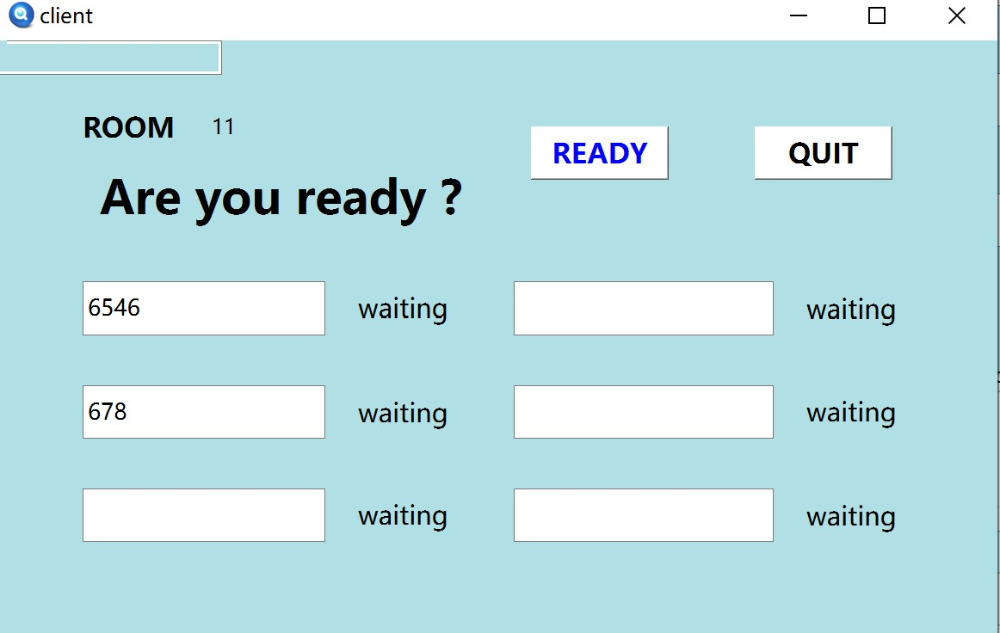
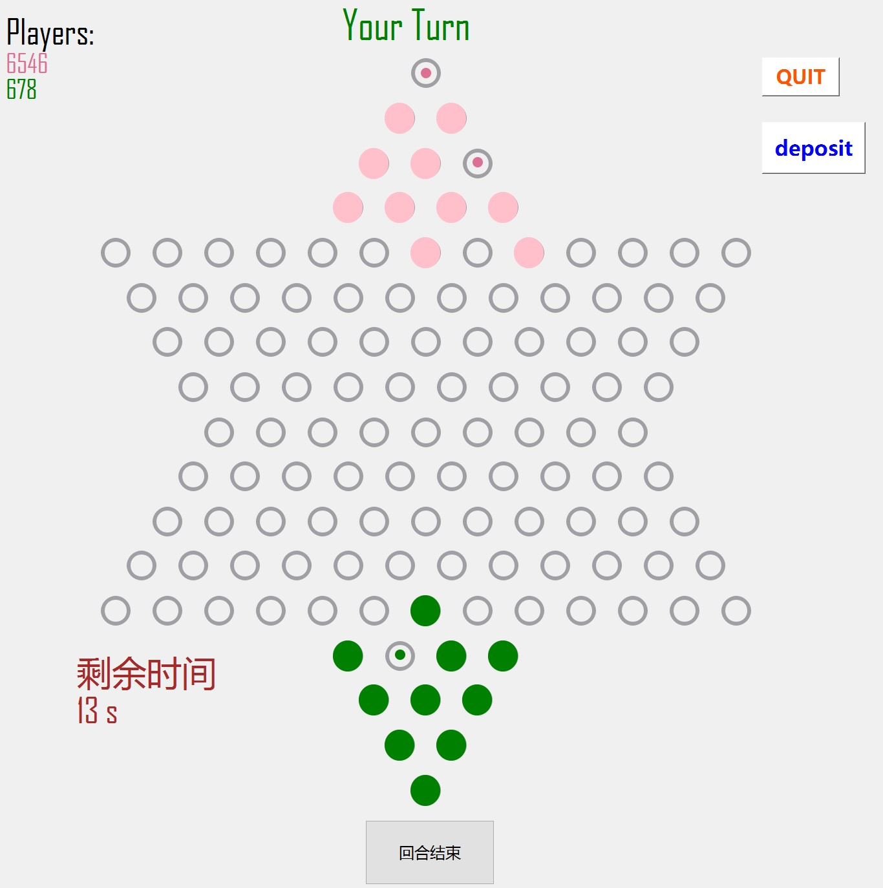

# 第三阶段报告

## 1.小组分工

+ 王卓冉：搜索、估值函数，显示轨迹，权值表
+ 苏家齐：修正信号的合法性判断和receive函数，与服务端测试
+ 骆娜：估值函数，权值表，等待页面完善、setStyleSheet

## 2.代码设计框架

### 2.1搜索可行位置
+ 分平动和跳跃两种方式，搜索10个棋子周围的合法可行位置，并用aipath记录可行的路径
+ 其中调用估值函数，利用PossibleValue1函数来计算棋子运行到各位置的价值大小并比较，保留价值更大的一种路径

### 2.2估值函数
+ 使用多个估值函数，Possiblevalue1为该行棋目标位置的估值，由vc（valuechange），bvc（bringevaluechange），msv（morestepvalue），ldf（longdistancefirst），fv（fillvalue）组成，通过几个值加权得到该行棋位置的估价，估价越高则优先移动
+ Vc(Valuechange)：即目标棋子移动后位置在估价表中的变化值，主要依靠估价表的设计，一般来说该值越高则行棋路径越远，离目标位置越近
+ Bvc(Bridgevaluechange)：主要由函数bridgevalue()和dfsbridge()实现，该函数为计算对手方某状态下所有可行行棋路线中最大的估值变化，bvc则为己方移动棋子前后，对手方最大行棋估值变化的差值，若为正，则该行棋有堵对手的桥，若为负，则在为对方搭桥。（由于本人下棋习惯喜欢搭桥，因此该函数实现后托管甚至有出现过向后移来堵本人计划好的长长的桥的现象，下的很恼火）
+ Msv(Morestepvalue)：由即下棋方走更多步时的估价，由函数morestepvalue()和dfsplus()实现，主要运用贪心搜索五步内可行棋路线，然后通过回溯将产生的估值相加得到第一步的估值，搜索深度并不深，但可一定程度实现搭桥
+ Ldf(Longdistancefirst)：由stepvalue()函数实现，计算该棋子到终局最尖端位置的坐标值的差，在有四颗棋子到达终局位置后，距离终局较远的棋子优先移动
+ Fv(Fillvalue)：由函数fillvalue()实现，计算已到终局位置棋子数量，若为10，则在msv中返回一个巨大值，在最短步数内到达终局

### 2.3权值表
+ 遵循两边价值低，中间价值高；距初始区域近价值低，距终点区域近价值高的基本原则制定权值表
+ 将权值表进行旋转分别为不同初始区域的玩家提供位置的价值

## 3.遇到的问题及解决方法

+ Q1：估值函数的设计

+ A1：最初想法是多写估值函数，进行全面的考虑，根据我们真人对战的情况，总结出连跳或跳跃优先，移动距离更远优先，先注意将棋子全部从初始区域移出的原则来写估值函数。关于估值函数，尝试了很多方法，用guessvalue1函数计算到目标区域的平均距离，若该区域有己方棋子占据则不计算在内；guessvalue2函数基于guessvalue1如果到中心区域一样，就选走到距离最长的；guessvalue4函数检查移动处是否可以跳跃；islonely函数检查是否是孤立点（优先跳跃，其次平动），lonelypointvalue检查孤立点数；distance函数计算目标位置到终点中心的距离

+ Q2：权值表的设计

+ A2：最初设计的估值函数在运行时出现了一个棋子在某两个位置之间来回跳的情况，于是将权值表进一步细化，分出更多阶的价值，且将各阶价值之间的差距变大了

+ Q3：关于搜索

+ A2：最早版本为一轮搜索，估值函数由行棋距离，步数等实现，棋子位置状态等实现，后发现行棋距离若直接计算前后棋子位置到终局位置之差，棋子在不同位置以同样方式跳跃产生的值变化不一致，而如果用坐标差则容易因搜索顺序走到偏僻的位置，均不如估值表来的直接；而通过步数则可能因为步数多走到奇怪的位置或是出现绕远路的情况等，遂放弃

## 4.效果展示

+ 1.增加客户端显示房间号

+ 2.增加AI功能并用相应颜色的点显示行棋轨迹

## 5.仓库链接

<https://github.com/AiRAM-S/Team5Checker>
