# 期末答辩
## 一、小组概况
### 小组成员
* 马境鸿
* 孙筠桐
* 邓李俊
### 小组分工
* 马境鸿   
  全程参与三个阶段，进行大作业的思路思考与代码编写，git与pre的报告撰写。
* 孙筠桐   
  全权负责第一阶段参与编写跳棋走法规则的编写，参与协助第二阶段的自动行棋与思路实现，参与第三阶段的算法实现与深搜规则指定。
* 邓李俊   
  参与第一个阶段的思路实现，参与第二阶段的服务端思路构思，参与第三阶段的思路实现。
## 二、各阶段任务完成情况
### 2.1第一阶段
#### 必选功能的实现情况
1. 完成多界面的切换。
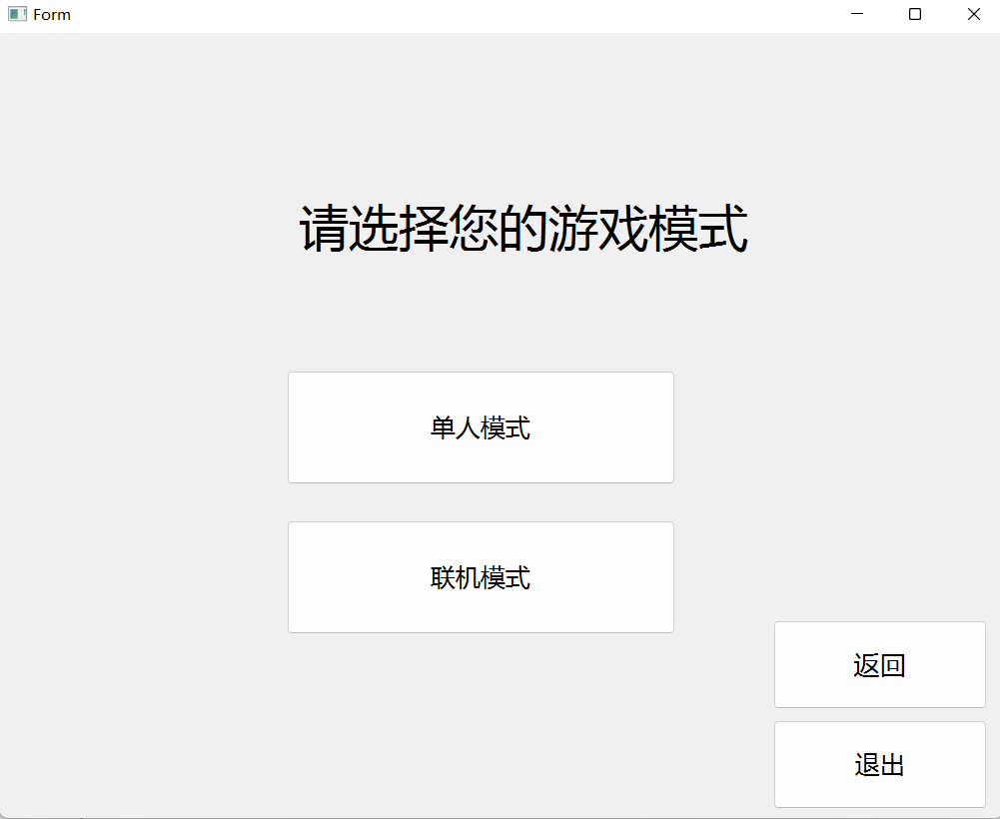
2. 完成棋盘与棋子的设计。
3. 完成行棋合法性的判断。
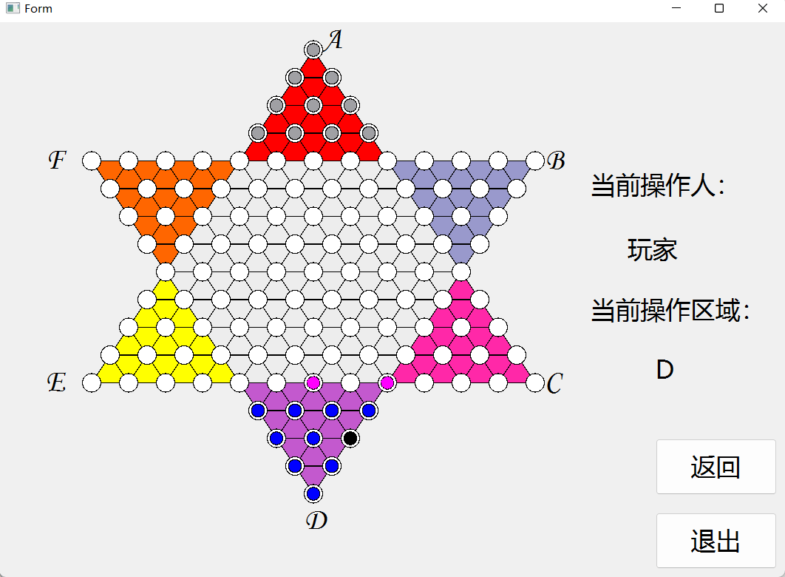
#### 额外功能的实现情况
1. 完成对选中棋子所有合法行棋的显示。
2. 根据助教的建议，使合法性的显示逐步进行，而不是一下子全盘呈现。
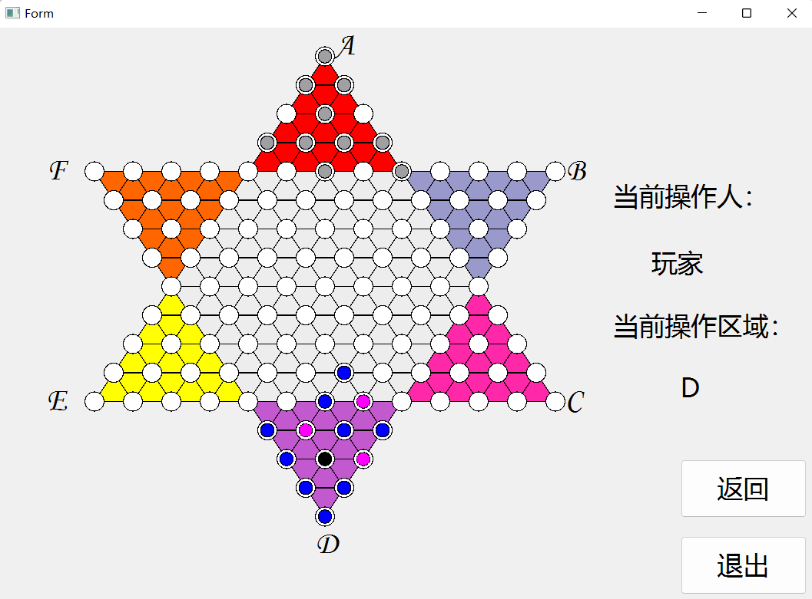
### 2.2第二阶段
#### 必须功能的实现情况
* 服务端
	1. 完成与客户端建立通信。
	2. 完成判断客户端行棋合法性的判断。
	3. 完成游戏胜负判定的功能。
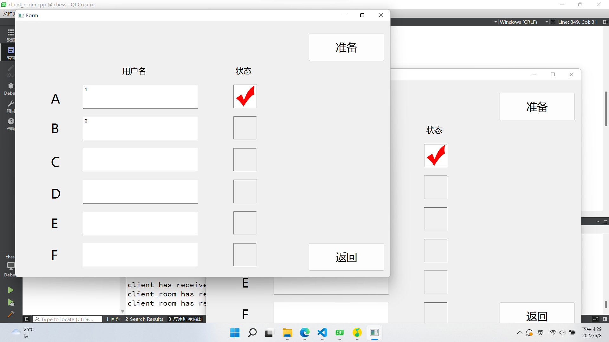
* 客户端
	1. 完成与服务端的通信功能
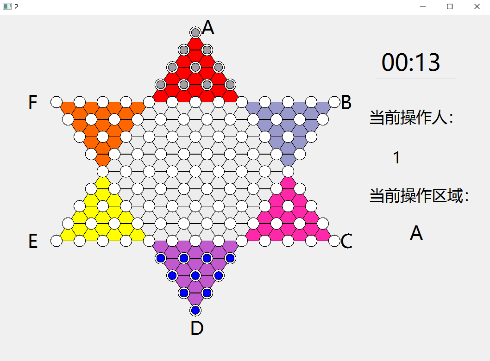
#### 额外功能的实现情况
### 2.3第三阶段
#### 必须功能的实现情况
1. 向玩家展示连跳的具体过程，每一步间隔0.5秒
2. 客户端各种bug的维护情况
3. 人工智能的实现
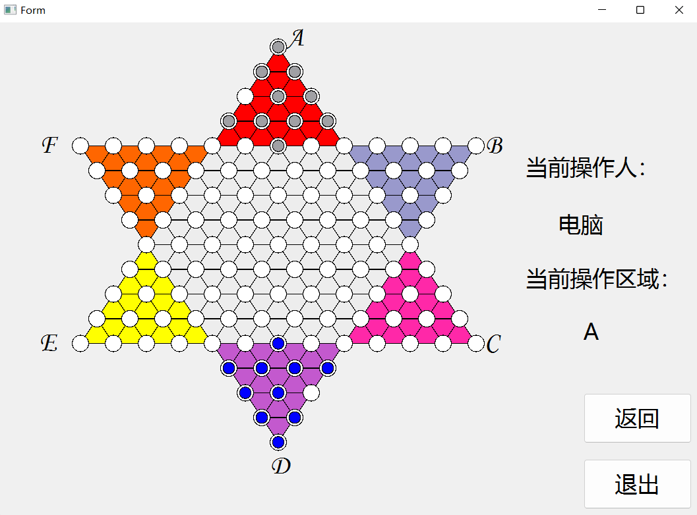
#### 额外功能的实现情况
1. 游戏新增模式人机对战，可以进行单机游戏与电脑对战。
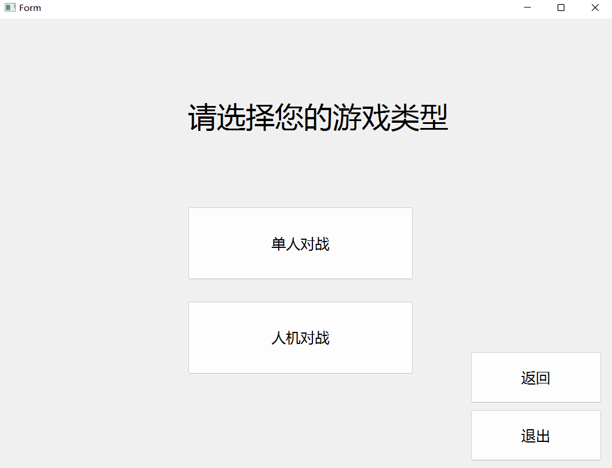
2. （正在完成的功能）AI的智能程度的选择，可以选择简单或者复杂模式。

## 三、项目整体框架
### 第一阶段   

主体为两个事件，一个画图事件，一个鼠标释放事件

1. 画图事件
    - 画棋盘
    - 画棋子
    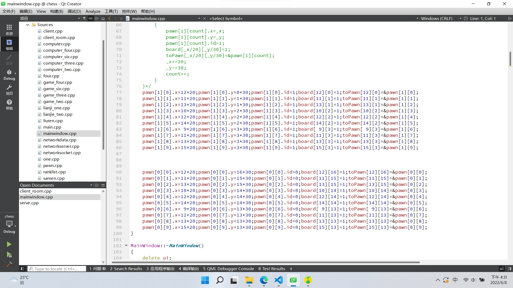
2. 鼠标释放事件
    - 判断哪一方在行棋，进行深搜判断合法性
    - 判断行棋结束，进行棋盘的重新绘制。

### 第二阶段

客户端与服务端主体都是对各种通信协议进行判断与进行相应的操作，还有判断胜负等功能。

1. 服务端
    - 各个协议的处理
    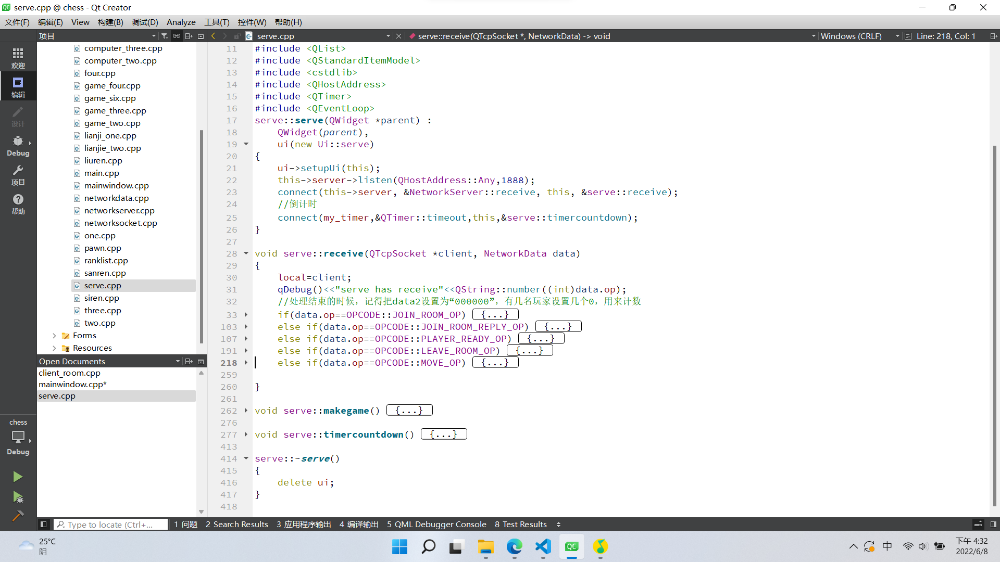
2. 客户端
    - 各个协议的处理
    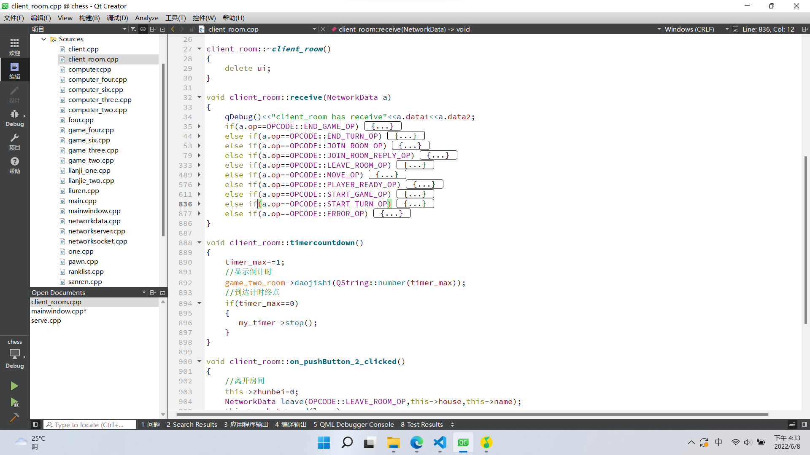
    - 四种房间的建立，对应四种游戏模式。
    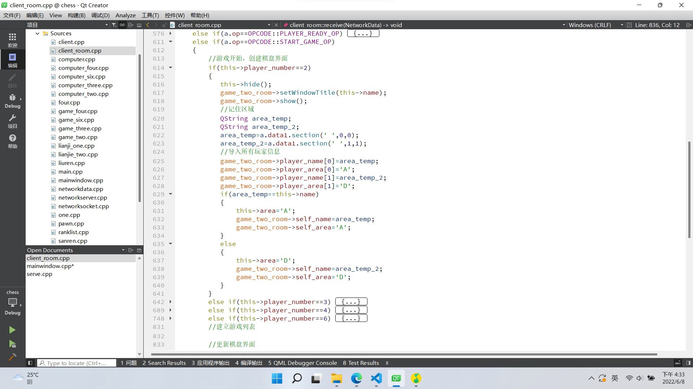

### 第三阶段    

人工智能的实现，主体为深搜算法，以两个原则为基础逻辑。  

1. 简单人机的实现
    - 距离最远原则
    - 靠后优先原则
2. 复杂人机的实现
    - 两步模拟距离最远原则。
    - 两步模拟靠后优先原则
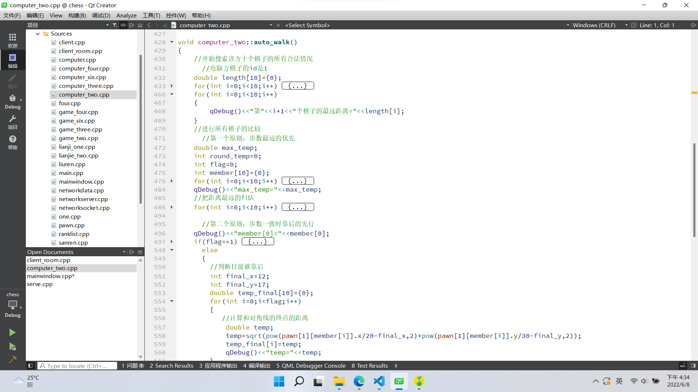
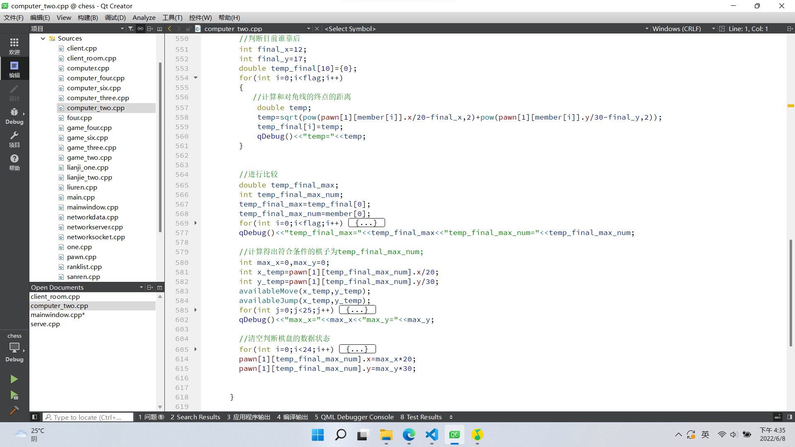

## 四、遇到的问题和解决方法

### 客户端socket交接问题

当时候我们想在同一个客户端建立两个socket，来分别处理房间界面与棋盘界面的信息请求，但发现只要重新设置一个以上的socket，客户端就会崩，也就是说，一个客户端只能拥有拥有一个socket。

解决方法：建立一个全局棋盘界面，在房间界面调用，这样只有房间界面拥有一个socket，消息传递用信号与槽。

### 服务端玩家轮转问题

无法处理玩家的按顺序行棋这一行为，没有思路实现这一功能。

解决办法：询问已经完成的组的同学，学习思路。

## 五、项目地址      
本小组大作业全部代码已上传到本人git库中，项目地址为：<https://github.com/ljhxhlsy/Bigwork>

## 六、写在最后       
很荣幸能完成这一项工程，或许将来的自己会对如此粗糙的代码报之一笑，但是不管怎样，一段段代码，完成了半年前那个看似不可能完成的任务，而我们，也是在一次又一次绝望之后，重拾了自己的信心，磨砺了自己的心境。这或许就是这一项大作业的目的，不是让你学会多么高深，多么复杂的知识；而是让你明白，在将来，不管多难的问题，都要勇往直前的走下去，彩虹，不也总在风雨后吗？
