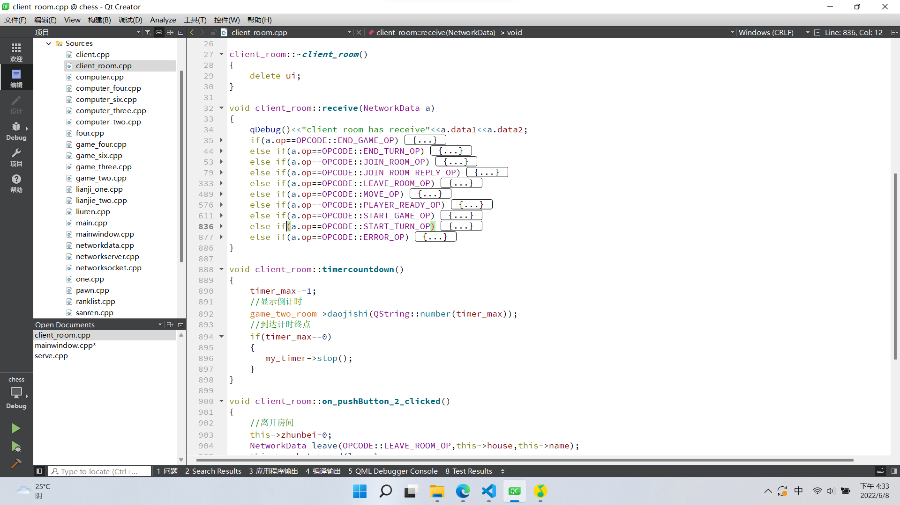
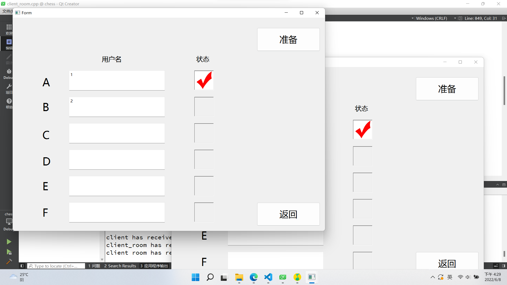

# 第二阶段报告
## 一、小组分工
* 马境鸿   
  参与第二阶段的服务端，客户端全部的思路制定与代码书写。
* 孙筠桐    
  参与第二阶段思路的制定，参与第二阶段关于行棋方面代码的书写。
* 邓李俊     
  参与第二阶段思路的制定，参与代码的讨论。
## 二、代码框架设计
### 1.服务端
#### 1.1信号连接的建立   
使用lisen函数监听socket的hello信号，并且建立了许多的链表与数组，便于处理的，并且需要直接随机提取的使用了数组，缺点是在进行增加删减工作时，需时刻注意越界问题。在处理难以处理的，比如socket地址等的储存，借助链表进行储存。
#### 1.2通信协议的处理
使用if和else，挨个进行对通信协议的各种信息的处理，并且执行下一步操作。这里有一点建议，就是一定要写好注释，表明当初建立的变量是干什么用的，用在哪里了。不然，越往后写，之前在各个地方建立的变量、数组、链表会记不清用途，所以一定要把注释写好，避免前后矛盾，浪费大量时间。

#### 1.3终局判断的处理
使用了效率比较低的挨个搜索，但是很可靠。虽然代码量大，但是运行可靠，便于挑错，在一个区域内若有十个满足条件的棋子即为胜利。并且当房间里只剩一名玩家时，游戏结束。
### 2.客户端
#### 2.1信号连接的建立
使用自带的hello函数与服务端建立联系，并且用信号与槽进行信息的反馈。连接成功后会进入房间界面，并且转交socket，保持与服务端联机的一致性。
#### 2.2棋盘的建立与行棋数据的读取
* 直接使用第一阶段的棋盘构建。但我们有两种想法，一种是保留客户端判断合法性的功能，一种是客户端取消判断合法性的功能，只提供棋子的状态。前者服务端可以大大减小代码，甚至服务端可以成为一种黑箱，只需要实现玩家轮转即可，如有不合法的行棋，客户端自己就可阻止。后者的优点是是客户端可以变得很简练，搭配适应性更强，更易于与其他小组的服务端兼容。最后我们决定两种都保留，在建立我们自己的服务端是用前者，减少服务端的代码量，当需要进行对抗赛时，使用轻便的客户端。
* 关于行棋数据的读取，我们采用了信号与槽，当棋盘界面收到行棋完成的信号（双击）时，触发信号，使用客户端的函数提取链表进行发送。
#### 2.3通信协议的处理
采用了if与else的逐个处理方法，为了使得更易于调错与维护，代码更实用，增加可靠性，我们几乎每一条协议都设置了两人、三人、四人、六人的四种情况。这么做虽然代码量很大，但是调试时，从最简单的二人入手即可快速查错，并且可靠性很高，代码虽然很简单，但简单就意味着可靠。

## 三、遇到的问题及解决方法
### 3.1 关于转接socket
#### 3.1.1 问题
当时候我们想在同一个客户端建立两个socket，来分别处理房间界面与棋盘界面的信息请求，但发现只要重新设置一个以上的socket，客户端就会崩，也就是说，一个客户端只能拥有拥有一个socket。在这里浪费了大量的时间与耐心，使得进度一度停顿。
#### 3.1.2 解决
在和其他的组进行讨论后，进行了转接socket，即不再建立新的socket，而是进行socket的转接，一个客户端所有界面公用一个socket。
### 3.2 关于房间的建立
#### 3.2.1 问题
建立房间页面与棋盘页面不能兼容的问题，两个ui界面无法进行操作。
#### 3.2.2 解决
建立全局变量，全局变量真的很好用，对其中的函数进行操作都很方便，并且也不存在不能兼容的问题。

## 四、程序运行部分截图

