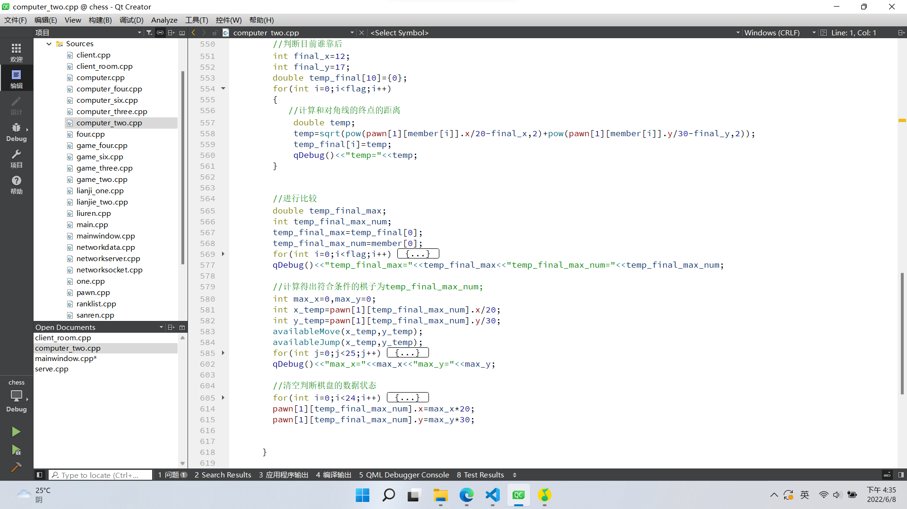

# 第三阶段报告
## 一、小组分工
* 马境鸿    
  负责第三阶段全部的思路建立与代码书写。
* 孙筠桐    
  参与第三阶段的思路建议与规则讨论。
* 邓李俊   
  参与第三阶段的规则讨论与代码书写的思路。
## 二、代码框架设计
### 2.1 基本算法

基本算法就是深搜，穷举与深搜。首先对只走不跳的棋子进行六个方向的搜索，然后根据情况更改状态数组里的值。然后对可以进行跳跃的棋子进行搜索，想个六个方向进行深搜，直到碰壁返回。这样就确定了一个棋子可以走的所有合法状态。（其实和第一阶段判断合法性的步骤一模一样）。
### 2.2 基本原则
有两个原则，距离最远原则与靠后优先原则.
* 距离最远原则    
  对当前玩家的十个棋子进行for循环，依次找出每个棋子可以走的最远距离，然后进行比较，选出可以走的最远的那个棋子，然后进行回溯找到途径的位置。若有不止一个棋子距离都最远且相同，进入第二个阶段。
  
* 靠后优先原则    
  对距离相等的棋子进行与获胜区域的最远端进行计算，找出距离最远端距离最大的棋子，先走后方的棋子。
  
> 以上原则是从4399游戏中通过观察电脑的下棋方式总结出来的。
## 三、遇到的问题及解决方法
### 坐标的运算
#### 问题
我们的坐标为直角坐标系，之前手动输入了所有棋子的坐标信息等。在后续处理中忘记了它的直角性质。。。。。
#### 解决
编写一个坐标转化函数，使得棋子坐标转化出来之后可以通用。（所以，良好的注释是不可缺少的，代码风格真的很重要）。
## 四、程序运行部分截图

