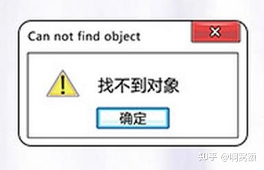

<h1 align="center">

</h1> 

#### 小组介绍

队名：面向空对象编程

English Name: We Will Have Girlfriends

GitHub Organization: [StopInvolution](https://github.com/StopInvolution)

代码仓库: [ChineseCheckers](https://github.com/StopInvolution/ChineseCheckers)
#### 小组成员
- 潘俊达(2021201626): **擅长睡觉，摸鱼**，负责跳棋 UI + 跳棋底层逻辑 + 服务端跳棋实现
- 贾昊霖(2021201552): **擅长不写作业，忘写作业，找各种理由逃作业**，负责服务端 + 多人房间 UI 实现
- 程云飞(2021201506): **既擅长睡觉摸鱼，又擅长不写作业，由此可以看出是组内最巨的**，负责托管 AI 实现
