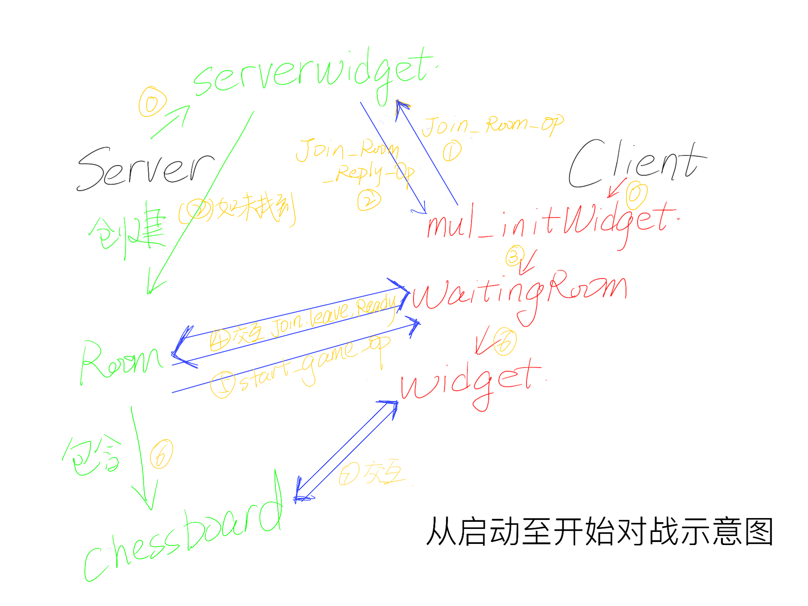
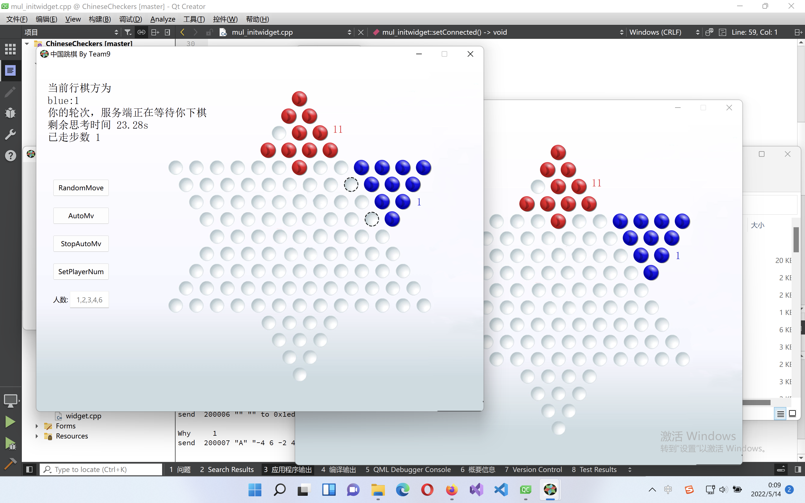

# Group 9 程设第二阶段作业报告

第二阶段，本组已经完成大部分用户界面与网络相关的操作，并且已经完成了支持多房间的准备工作。

## 小组分工

- 潘俊达在本阶段负责棋盘的接口优化和开发以及信号处理。
- 贾昊霖在本阶段负责网络连接，窗体UI设计和信号处理。

## 代码思路

### 整体框架

整个流程中我们选择了**大厅-房间-战局**的结构，用户可以选择 _创建新房间_ 以生成一串16进制形式数字作为房间号，也可以选择 _加入房间_ 尝试进入指定房间号的房间。对战结束后，玩家关闭棋盘即可返回主界面并开始下一次游玩。服务端将房间和战局组合成一个整体，对客户端信号作出回应。

### 网络连接：客户端

在客户端创建时，程序立即在内存空间申请一个 `NetworkSocket`。这个套接字生命周期将与与客户端多人游戏界面生命周期保持一致。

通过在不同窗口之间传递 NetworkSocket，我们保证了多个窗口都可以收到 server 发出的数据；通过 `connect` 和 `disconnect`，我们确保所有数据在同一时间有且只有一个窗口作出响应。

### 网络连接：服务端

在服务端处理上，我们选择了可拓展性比较强的一种写法：在`ServerWidget` 中维护一个 `Qvector<Room> roomList` 存储当前所有房间；接收消息之后找到对应房间再进行后续操作。

此外，我们还在服务端内设计了控制台，控制台内可以输入指令实现诸如强制开始游戏，踢出玩家或打印玩家信息等一系列操作。

### 信号处理

在服务端上，我们选择了**服务端接收-棋盘处理-服务端发射**的运作方式，服务端通过调用函数向棋盘传递信息，棋盘则通过发射信号告知服务器相关操作的结果或间接发送数据，指挥服务器反馈，同时自身启动棋盘窗口实时展示。

在客户端处，在比赛开始前，信号由大厅界面和房间界面处理，开始游戏后，套接字会被转交给战局界面：我们选择的运作方式是**转交socket至棋盘**，让 widget 对信号进行处理。

## 问题&解决/构想

1. 远程联机

内网穿透小应用已经成功：这个方案最诱人之处在于是可以实现远程联机的。

2. 多窗口的网络交接

最开始计划仅传递 `QTcpSocket`，但随后的实践中我们意识到如果创建新的 `NetworkSocket` 服务器并不知晓，会错将新的连接视作新用户而出错，因此最后选择了传递 `NetworkSocket`。

3. 实现上的小失误

位置分配的时候选择了最简单的`A B C D E F`再发送其切片，但很显然这是不正确的：正确的发送应当为`A D` / `A C E` / `B C E F` / `A B C D E F`。这个错误已经通过枚举弥补。

